# Deteksi COVID-19 pada Citra Chest X-Ray
## Komparasi Machine Learning Klasik dan Deep Learning dengan LoRA

<div align="center">

<a href="https://www.python.org/"></a>
<a href="https://www.tensorflow.org/"></a>
<a href="https://creativecommons.org/licenses/by-sa/4.0/"></a>

</div>

---

Repository ini berisi dokumentasi teknis, eksperimen, dan kode implementasi untuk proyek pembelajaran mesin (Machine Learning) yang bertujuan mendeteksi COVID-19, Pneumonia Non-COVID, dan kondisi Paru Normal menggunakan citra Chest X-Ray.

> 📖 **Dokumentasi Lengkap:** [Baca dokumentasi online](https://hisyam99.github.io/MACHINE_LEARNING_PROJECT/) | [Build lokal](#-membangun-dokumentasi-lokal)

---

## 📋 Daftar Isi

- [👥 Anggota Kelompok](#-anggota-kelompok)
- [🎯 Tentang Proyek](#-tentang-proyek)
- [📊 Dataset](#-dataset)
- [🛠️ Metodologi](#️-metodologi)
- [🧪 Eksperimen](#-eksperimen)
- [📈 Hasil Eksperimen](#-hasil-eksperimen)
- [🚀 Cara Menggunakan](#-cara-menggunakan)
- [📊 Output & Visualisasi](#-output--visualisasi)
- [💡 Kesimpulan](#-kesimpulan)
- [🔮 Future Work](#-future-work)
- [📚 Referensi](#-referensi)
- [📄 Dokumentasi](#-dokumentasi)

---

## 👥 Anggota Kelompok

| NIM | Nama |
| :--- | :--- |
| **202210370311060** | **Muhammad Hisyam Kamil** |
| **202210370311449** | **Elga Putri Tri Farma** |

**Institusi:** Universitas Muhammadiyah Malang (UMM)  
**Mata Kuliah:** Machine Learning  
**Semester:** 7

---

## 🎯 Tentang Proyek

### 📊 Academic Poster

<div align="center">

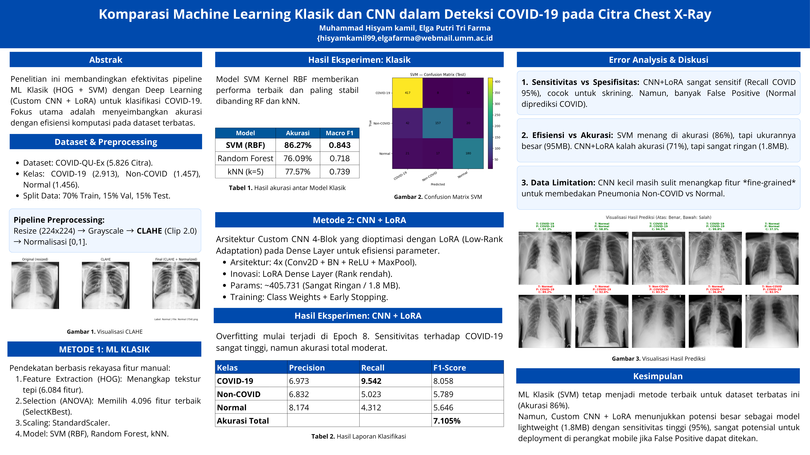

**Academic Poster - Deteksi COVID-19 pada Citra Chest X-Ray**

</div>

---

### Tujuan Penelitian

Proyek ini bertujuan untuk:

1. **Membandingkan efektivitas** pendekatan klasik (HOG + SVM) vs Deep Learning (CNN, Transfer Learning, ViT + LoRA)
2. **Mengevaluasi trade-off** antara akurasi dan efisiensi komputasi pada dataset terbatas
3. **Mengembangkan model lightweight** yang cocok untuk deployment di perangkat mobile/edge
4. **Mengevaluasi dampak** data augmentation dan transfer learning pada performa model

### Klasifikasi Tiga Kelas

Proyek ini melakukan klasifikasi citra Chest X-Ray menjadi tiga kelas:

1. **COVID-19** - Infeksi COVID-19
2. **Non-COVID** - Pneumonia Viral atau Bacterial (bukan COVID-19)
3. **Normal** - Kondisi paru-paru normal

### ✨ Hasil Utama

| Metrik | Nilai |
|:------|:-----:|
| **Model Terbaik** | HuggingFace ViT Pretrained |
| **Akurasi** | **91.65%** |
| **Macro F1** | **0.9017** |
| **F1 COVID-19** | **0.9601** |

### 🏆 Pencapaian

- ✅ **Transfer Learning unggul:** DenseNet121 + LoRA (82.04%) dan HF ViT (91.65%) mengungguli model from scratch
- ✅ **Data Augmentation penting:** Meningkatkan Custom CNN dari 71.74% menjadi 81.35% akurasi
- ✅ **SVM masih relevan:** 86.27% akurasi sebagai baseline kuat tanpa GPU training
- ✅ **Model lightweight:** Custom CNN + LoRA hanya ~1.8 MB dengan performa 81.35%

---

## 📊 Dataset

### COVID-QU-Ex Dataset

Proyek ini menggunakan dataset **COVID-QU-Ex** dari Qatar University. Dataset ini merupakan salah satu dataset terbesar untuk deteksi dan segmentasi COVID-19 dari citra X-Ray.

### Statistik Dataset Lengkap

- **Total Citra:** 33,920 gambar Chest X-Ray (full dataset)
- **Dataset yang Digunakan:** 5,826 gambar (Infection Segmentation subset)

### Distribusi Kelas

| Kelas | Jumlah | Persentase |
|:------|:------:|:----------:|
| **COVID-19** | 2,913 | 50.0% |
| **Non-COVID** | 1,457 | 25.0% |
| **Normal** | 1,456 | 25.0% |
| **Total** | **5,826** | **100%** |

### Pembagian Data (Stratified Split)

| Split | COVID-19 | Non-COVID | Normal | Total | Persentase |
|:------|:--------:|:---------:|:------:|:-----:|:----------:|
| **Train** | 2,039 | 1,020 | 1,019 | 4,078 | 70% |
| **Validation** | 437 | 219 | 218 | 874 | 15% |
| **Test** | 437 | 218 | 219 | 874 | 15% |

### Cara Mendapatkan Dataset

1. **Download dari Kaggle:**
   ```bash
   pip install kaggle
   kaggle datasets download -d anasmohammedtahir/covidqu
   unzip covidqu.zip -d datasets/
   ```

2. **Link Dataset:** https://www.kaggle.com/datasets/anasmohammedtahir/covidqu

3. **Lisensi:** CC BY-SA 4.0 (Creative Commons Attribution-ShareAlike 4.0)

---

## 🛠️ Metodologi

### 1. Preprocessing Data

Pipeline preprocessing yang diterapkan pada semua citra:

1. **Grayscale Conversion** - Konversi citra ke skala abu-abu
2. **Resize** - Standarisasi ukuran menjadi `224×224` piksel
3. **CLAHE (Contrast Limited Adaptive Histogram Equalization)**
   - Clip Limit: 2.0
   - Tile Grid Size: 8×8
   - Meningkatkan kontras lokal untuk menonjolkan struktur paru
4. **Heuristic Lung Cropping** - Otomatis crop area paru-paru menggunakan thresholding & connected components
5. **Normalisasi** - Skala piksel ke rentang `[0, 1]`

#### Implementasi Preprocessing

```python
import cv2
import numpy as np

def apply_clahe(img01):
    """Apply CLAHE to normalized image."""
    u8 = (img01 * 255).astype(np.uint8)
    clahe = cv2.createCLAHE(clipLimit=2.0, tileGridSize=(8, 8))
    eq = clahe.apply(u8)
    return eq.astype(np.float32) / 255.0

def heuristic_lung_crop(img01, padding=20):
    """Crop lung area using heuristic method."""
    H, W = img01.shape
    u8 = (img01 * 255).astype(np.uint8)
    _, m = cv2.threshold(u8, 0, 255, cv2.THRESH_BINARY_INV + cv2.THRESH_OTSU)
    num, lab = cv2.connectedComponents(m)
    
    areas = sorted([(k, int((lab == k).sum())) for k in range(1, num)], 
                   key=lambda x: x[1], reverse=True)
    keep_areas = areas[:2]
    
    mask = np.zeros_like(m, dtype=np.uint8)
    for k, _ in keep_areas:
        mask[lab == k] = 255
    
    ys, xs = np.where(mask > 0)
    x0, x1 = max(0, xs.min() - padding), min(W - 1, xs.max() + padding)
    y0, y1 = max(0, ys.min() - padding), min(H - 1, ys.max() + padding)
    crop = img01[y0:y1+1, x0:x1+1]
    
    return cv2.resize(crop, (224, 224), interpolation=cv2.INTER_AREA)
```

### 2. TASK 1: Machine Learning Klasik

#### Feature Engineering

**1. HOG (Histogram of Oriented Gradients)**
- Menangkap tekstur dan pola tepi
- Parameter:
  - Orientations: 9 bins
  - Pixels per cell: (16, 16) piksel
  - Cells per block: (2, 2) sel
  - Block normalization: L2-Hys
- Menghasilkan vektor fitur **6,084 dimensi** per gambar

**2. Feature Selection (SelectKBest)**
- Metode: ANOVA F-test
- Memilih **4,096 fitur terbaik** dari 6,084 fitur
- Reduksi dimensi ~33%

**3. Scaling (StandardScaler)**
- Standarisasi fitur untuk stabilitas distribusi
- Mean: 0, Standard Deviation: 1

#### Model yang Diuji

**A. SVM (RBF Kernel)**
- C=10, Class Weight: Balanced
- **Best performer** dengan akurasi **86.27%**
- Macro F1: 0.843

**B. Random Forest**
- 300 trees
- Akurasi: 76.09%
- Macro F1: 0.719

**C. k-Nearest Neighbors (kNN)**
- k=5
- Akurasi: 77.57%
- Macro F1: 0.739

### 3. TASK 2: Custom CNN + LoRA

#### Arsitektur

- **4 Blok Konvolusi:**
  - Conv2D → BatchNorm → ReLU → MaxPool
  - Filter: 32, 64, 128, 256
- **LoRA (Low-Rank Adaptation)**
  - Mengganti Dense Layer standar dengan `LoRADense`
  - Efisiensi parameter tinggi
- **Spesifikasi Model:**
  - Parameter: ~405,731
  - Ukuran: ~1.8 MB (sangat lightweight)
  - Input: 224×224×1 (grayscale)

#### Training Configuration

- **Optimizer:** Adam (LR=0.001)
- **Loss:** Categorical Crossentropy dengan Class Weights
- **Callbacks:** Early Stopping, Model Checkpoint, ReduceLROnPlateau
- **Augmentation:** Dengan dan tanpa data augmentation

#### Variasi Eksperimen

**1. Custom CNN (No Augmentation)**
- Akurasi: 71.74%
- Macro F1: 0.6586

**2. Custom CNN (With Augmentation)**
- Akurasi: 81.35%
- Macro F1: 0.7825
- **Peningkatan:** +9.61% akurasi

### 4. TASK 3: Transfer Learning + Vision Transformer

#### Model yang Diuji

**A. DenseNet121 + LoRA**
- Pretrained pada ImageNet
- Fine-tuning dengan LoRA pada layer akhir
- Data augmentation diterapkan
- Akurasi: 82.04%
- Macro F1: 0.8003

**B. Vision Transformer (ViT)**
- **Manual Implementation:** ViT dari scratch
  - Akurasi: 68.54%
  - Macro F1: 0.6645
- **HuggingFace Pretrained:** ViT-Base/16 pretrained
  - Akurasi: **91.65%** (TERBAIK)
  - Macro F1: **0.9017**
  - F1 COVID-19: **0.9601**

#### Data Augmentation

- Random Rotation (±15°)
- Random Zoom (0.9-1.1)
- Random Brightness/Contrast
- Horizontal Flip (50% probability)

### 5. LoRA (Low-Rank Adaptation)

**Konsep:**
- Teknik untuk fine-tuning model besar dengan cara yang efisien
- Menambahkan matriks low-rank ke weight yang sudah ada
- Formula: `W_new = W_original + BA`
- Hanya **B** dan **A** yang di-train

**Parameter:**
- Rank (r): Biasanya 4, 8, atau 16
- Alpha (α): Biasanya 32 atau 64
- Scaling: α/r

**Efisiensi:**
- Full Fine-tuning: ~25M parameters
- LoRA (r=4): ~400K parameters
- **Reduction: 98.4%**

---

## 🧪 Eksperimen

### TASK 1: Classic ML

**File:** `TASK_1:PREPROCESS+FEATEXTRACT+CLASSICMODEL.ipynb`

**Implementasi:**
1. Preprocessing dengan pipeline standar
2. HOG Feature Extraction (6,084 dimensi)
3. Feature Selection dengan SelectKBest (4,096 fitur)
4. Scaling dengan StandardScaler
5. Training model: SVM, Random Forest, kNN

**Hasil:**
- SVM (RBF): **86.27%** akurasi (terbaik)
- kNN (k=5): 77.57% akurasi
- Random Forest: 76.09% akurasi

### TASK 2: Custom CNN + LoRA

**File:** `TASK_2:CNN+LoRA.ipynb`

**Implementasi:**
1. Build Custom CNN dengan 4 blok konvolusi
2. Implementasi LoRA Dense Layer
3. Training dengan dan tanpa augmentation
4. Evaluasi dan visualisasi

**Hasil:**
- Custom CNN (+Aug): **81.35%** akurasi
- Custom CNN (No Aug): 71.74% akurasi
- **Peningkatan dengan augmentation:** +9.61%

### TASK 3: Pretrained Models + ViT

**File:** `TASK_3:PretrainedDenseNet+ViT+Augmentation+LoRA.ipynb`

**Implementasi:**
1. DenseNet121 + LoRA (transfer learning)
2. Vision Transformer manual (from scratch)
3. HuggingFace ViT Pretrained (fine-tuning)
4. Evaluasi dan perbandingan

**Hasil:**
- HF ViT Pretrained: **91.65%** akurasi (TERBAIK)
- DenseNet121 + LoRA: 82.04% akurasi
- ViT Manual: 68.54% akurasi

---

## 📈 Hasil Eksperimen

### Perbandingan Performa pada Test Set

#### Machine Learning Klasik

| Model | Akurasi | Macro F1 | Catatan |
| :--- | :---: | :---: | :--- |
| **SVM (RBF)** | **86.27%** | **0.843** | Best overall, stabil, presisi tinggi |
| **kNN (k=5)** | 77.57% | 0.739 | Rentan high dimensionality |
| **Random Forest** | 76.09% | 0.719 | Struggles dengan non-linear kompleks |

#### Deep Learning Models

| Model | Akurasi | Macro F1 | Weighted F1 | F1 COVID-19 | F1 Non-COVID | F1 Normal |
| :--- | :---: | :---: | :---: | :---: | :---: | :---: |
| **HF ViT Pretrained** | **91.65%** | **0.9017** | **0.9163** | **0.9601** | **0.8677** | **0.8773** |
| **DenseNet121 + LoRA** | 82.04% | 0.8003 | 0.8187 | 0.8743 | 0.7241 | 0.8025 |
| **Custom CNN (+Aug, LoRA Head)** | 81.35% | 0.7825 | 0.8093 | 0.8901 | 0.6601 | 0.7972 |
| **Custom CNN (No Aug, LoRA Head)** | 71.74% | 0.6586 | 0.7024 | 0.8342 | 0.4788 | 0.6627 |
| **ViT (Keras)** | 68.54% | 0.6645 | 0.6876 | 0.7569 | 0.5921 | 0.6446 |

### Analisis Utama

#### 1. Performa Terbaik: HuggingFace ViT Pretrained

- **Akurasi tertinggi:** 91.65% (mengalahkan semua model termasuk SVM)
- **Macro F1 tertinggi:** 0.9017
- **F1 COVID-19 sangat tinggi:** 0.9601 (deteksi COVID-19 sangat akurat)
- **Keseimbangan kelas baik:** F1 untuk semua kelas di atas 0.87
- **Kesimpulan:** Transfer learning dengan Vision Transformer pretrained memberikan hasil terbaik

#### 2. Keunggulan Machine Learning Klasik (SVM)

- Fitur terstruktur dari HOG terbukti robust untuk ukuran dataset ini
- Akurasi 86.27% dengan stabilitas tinggi (terbaik kedua setelah HF ViT)
- Ukuran model relatif besar (~95 MB) namun performa optimal
- **Masih relevan** sebagai baseline yang kuat tanpa memerlukan GPU training

#### 3. Dampak Data Augmentation pada Custom CNN

- **Tanpa Augmentation:** Akurasi 71.74%, Macro F1 0.6586
- **Dengan Augmentation:** Akurasi 81.35%, Macro F1 0.7825
- **Peningkatan signifikan:** +9.61% akurasi, +0.1239 Macro F1
- **F1 Non-COVID meningkat drastis:** 0.4788 → 0.6601 (peningkatan 37.8%)
- **Kesimpulan:** Data augmentation sangat penting untuk model kecil dari scratch

#### 4. Transfer Learning vs From Scratch

- **DenseNet121 + LoRA:** 82.04% akurasi (transfer learning)
- **Custom CNN + Aug:** 81.35% akurasi (from scratch)
- **ViT Keras (from scratch):** 68.54% akurasi (terendah)
- **Kesimpulan:** Transfer learning memberikan keunggulan signifikan, terutama dengan pretrained weights yang baik

#### 5. Analisis Per Kelas

- **F1 COVID-19:** Semua model deep learning mencapai >0.75, dengan HF ViT mencapai 0.9601
- **F1 Non-COVID:** Kelas paling sulit, hanya HF ViT dan DenseNet121 yang mencapai >0.70
- **F1 Normal:** Performa relatif baik untuk semua model (>0.64)
- **Kesimpulan:** Non-COVID pneumonia adalah kelas paling challenging untuk dibedakan

#### 6. Efisiensi vs Akurasi

- **HF ViT Pretrained:** Akurasi tertinggi (91.65%) namun memerlukan resources lebih besar
- **DenseNet121 + LoRA:** Keseimbangan baik (82.04%) dengan efisiensi parameter melalui LoRA
- **Custom CNN + LoRA:** Sangat lightweight (~1.8 MB) dengan performa 81.35% (dengan augmentation)
- **Trade-off:** Pilih berdasarkan use case (akurasi maksimal vs deployment mobile/edge)

---

## 🚀 Cara Menggunakan

### Prerequisites

```bash
# Python 3.8+
pip install numpy pandas matplotlib seaborn
pip install scikit-learn
pip install tensorflow>=2.10
pip install opencv-python
pip install tqdm
pip install jupyter

# Optional: Untuk Vision Transformer
pip install transformers
pip install torch torchvision
```

### Menjalankan Eksperimen

1. **Setup Dataset**
   - Download dataset COVID-QU-Ex dari Kaggle
   - Extract ke folder `datasets/`
   - Struktur folder harus sesuai dengan yang diharapkan notebook

2. **TASK 1: Classic ML**
   ```bash
   jupyter notebook "TASK_1:PREPROCESS+FEATEXTRACT+CLASSICMODEL.ipynb"
   ```
   - Menjalankan preprocessing, HOG extraction, dan training model klasik

3. **TASK 2: Custom CNN + LoRA**
   ```bash
   jupyter notebook "TASK_2:CNN+LoRA.ipynb"
   ```
   - Training Custom CNN dengan LoRA

4. **TASK 3: Transfer Learning + ViT**
   ```bash
   jupyter notebook "TASK_3:PretrainedDenseNet+ViT+Augmentation+LoRA.ipynb"
   ```
   - Training dengan pretrained models dan Vision Transformer

### Output

- Model weights disimpan di folder `artifacts/`
- Visualisasi disimpan di folder `output_images/`
- Metrics dan classification reports tersedia di notebook

---

## 📊 Output & Visualisasi

### Grafik Training

#### Custom CNN + LoRA (No Augmentation)

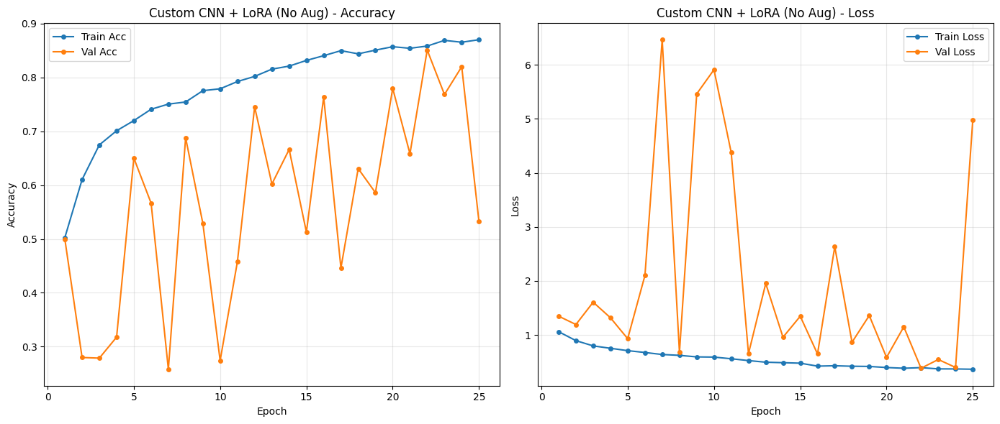

**Observasi:**
- Overfitting mulai terjadi di Epoch 8
- Training accuracy mencapai ~85%
- Validation accuracy plateau di ~72%

#### Custom CNN + LoRA (With Augmentation)


**Observasi:**
- Training lebih stabil
- Training dan validation lebih seimbang
- Overfitting berkurang signifikan

#### DenseNet121 + LoRA


**Observasi:**
- Konvergensi cepat
- Training dan validation seimbang
- Stabil dan konsisten

#### Vision Transformer (Manual)

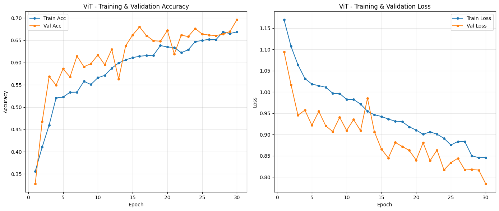

**Observasi:**
- Training lebih lambat
- Perlu lebih banyak epochs
- Struggles dengan dataset terbatas

#### HuggingFace ViT Pretrained


**Observasi:**
- Konvergensi sangat cepat
- Training dan validation sangat seimbang
- Performa terbaik

### Benchmark Performa

#### Accuracy per Model


**Highlights:**
- HF ViT Pretrained: 91.65% (tertinggi)
- SVM (RBF): 86.27% (terbaik kedua)
- DenseNet121 + LoRA: 82.04%

#### Macro F1 per Model


**Highlights:**
- HF ViT Pretrained: 0.9017 (tertinggi)
- SVM (RBF): 0.843 (terbaik kedua)
- DenseNet121 + LoRA: 0.8003

#### Accuracy vs Macro F1


**Observasi:**
- Korelasi positif antara accuracy dan macro F1
- HF ViT Pretrained unggul di kedua metrik
- SVM menunjukkan keseimbangan baik

#### All Models Benchmark - Accuracy


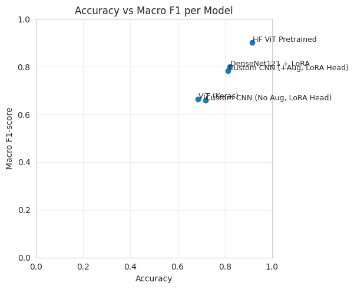

#### All Models Benchmark - Macro F1


### Analisis Per Kelas

#### Per-Class F1-Score


**Observasi:**
- F1 COVID-19: Semua model >0.75, HF ViT mencapai 0.9601
- F1 Non-COVID: Hanya HF ViT dan DenseNet121 >0.70
- F1 Normal: Semua model >0.64

#### Per-Class Error Rate (Recall)

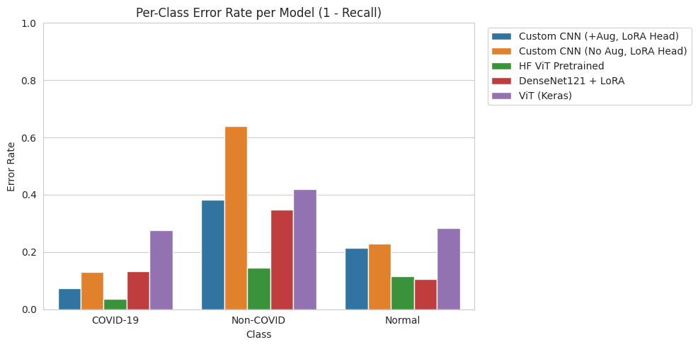

**Observasi:**
- COVID-19: Error rate rendah untuk semua model
- Non-COVID: Error rate lebih tinggi (kelas paling sulit)
- Normal: Error rate menengah

### Confusion Matrix

#### Custom CNN + LoRA (No Augmentation)

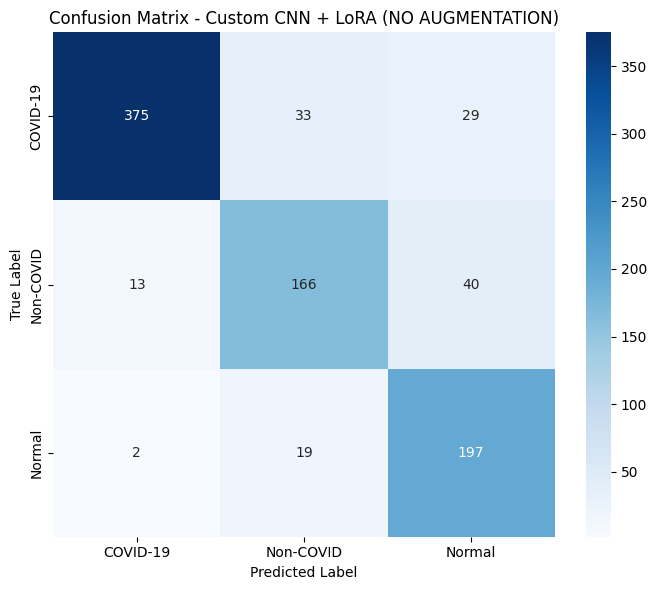

**Observasi:**
- Banyak false positives untuk COVID-19
- Non-COVID sering salah klasifikasi
- Normal sering diprediksi sebagai COVID-19

#### Custom CNN + LoRA (With Augmentation)

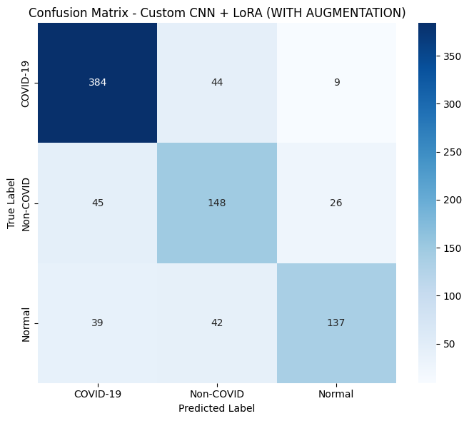

**Observasi:**
- False positives berkurang
- Non-COVID lebih akurat
- Keseimbangan lebih baik

#### DenseNet121 + LoRA


**Observasi:**
- Keseimbangan baik untuk semua kelas
- False positives dan negatives seimbang
- Performa konsisten

#### Vision Transformer (Manual)


**Observasi:**
- Struggles dengan semua kelas
- Banyak kesalahan klasifikasi
- Perlu dataset lebih besar

#### HuggingFace ViT Pretrained


**Observasi:**
- Keseimbangan sangat baik
- False positives dan negatives minimal
- Performa terbaik

### Visualisasi Prediksi

#### Custom CNN + LoRA (No Augmentation)

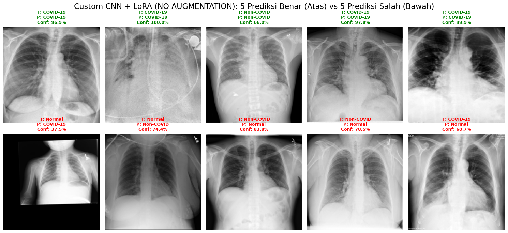

**Observasi:**
- Prediksi benar: Confidence tinggi untuk COVID-19
- Prediksi salah: Normal sering diprediksi sebagai COVID-19
- False positives dengan confidence tinggi

#### Custom CNN + LoRA (With Augmentation)

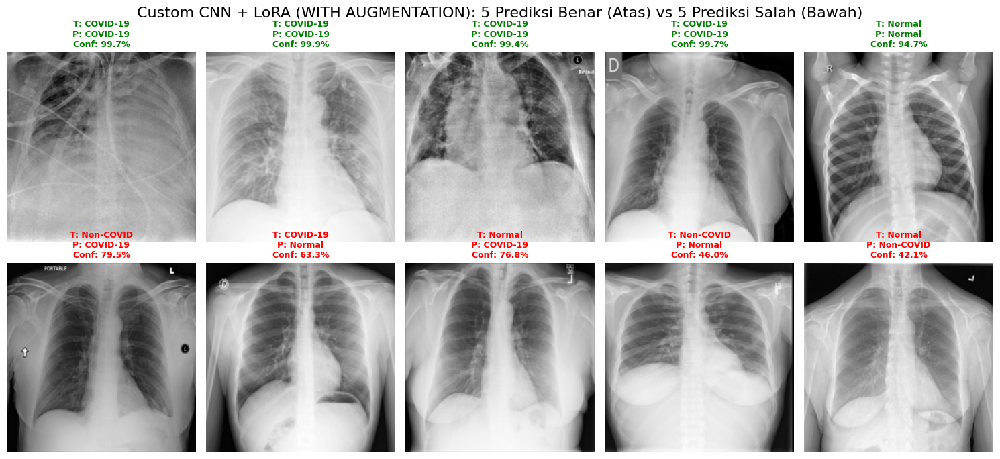

**Observasi:**
- Prediksi benar: Confidence lebih seimbang
- Prediksi salah: Masih ada false positives, tapi lebih sedikit
- Perbaikan signifikan dengan augmentation

#### DenseNet121 + LoRA

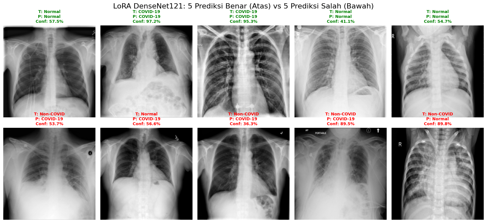

**Observasi:**
- Prediksi benar: Confidence tinggi dan konsisten
- Prediksi salah: Lebih sedikit false positives
- Keseimbangan baik

#### Vision Transformer (Manual)

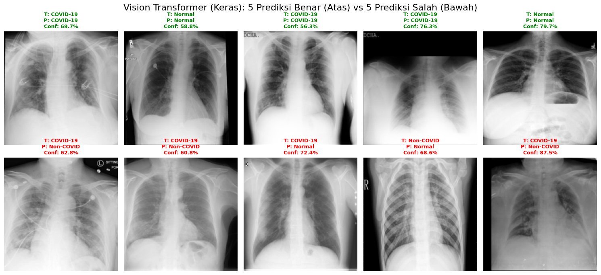

**Observasi:**
- Prediksi benar: Confidence bervariasi
- Prediksi salah: Banyak kesalahan klasifikasi
- Struggles dengan dataset terbatas

#### HuggingFace ViT Pretrained


**Observasi:**
- Prediksi benar: Confidence sangat tinggi dan konsisten
- Prediksi salah: Sangat sedikit false positives
- Performa terbaik

### Classic ML Visualizations

#### SVM RBF - Confusion Matrix


#### SVM RBF - Decision Boundary (PCA 2D)


#### SVM RBF - Confidence Distribution


#### SVM RBF - Sample Predictions


#### SVM RBF - Error Analysis


#### Random Forest - Confusion Matrix


#### Random Forest - Feature Importances


#### Random Forest - Tree Visualization


#### Random Forest - Sample Predictions

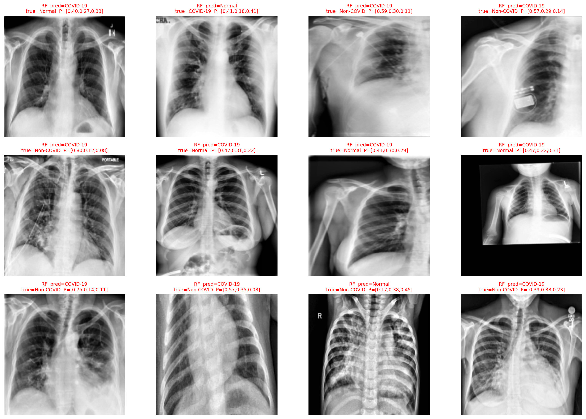

#### kNN - Confusion Matrix


#### kNN - t-SNE Visualization

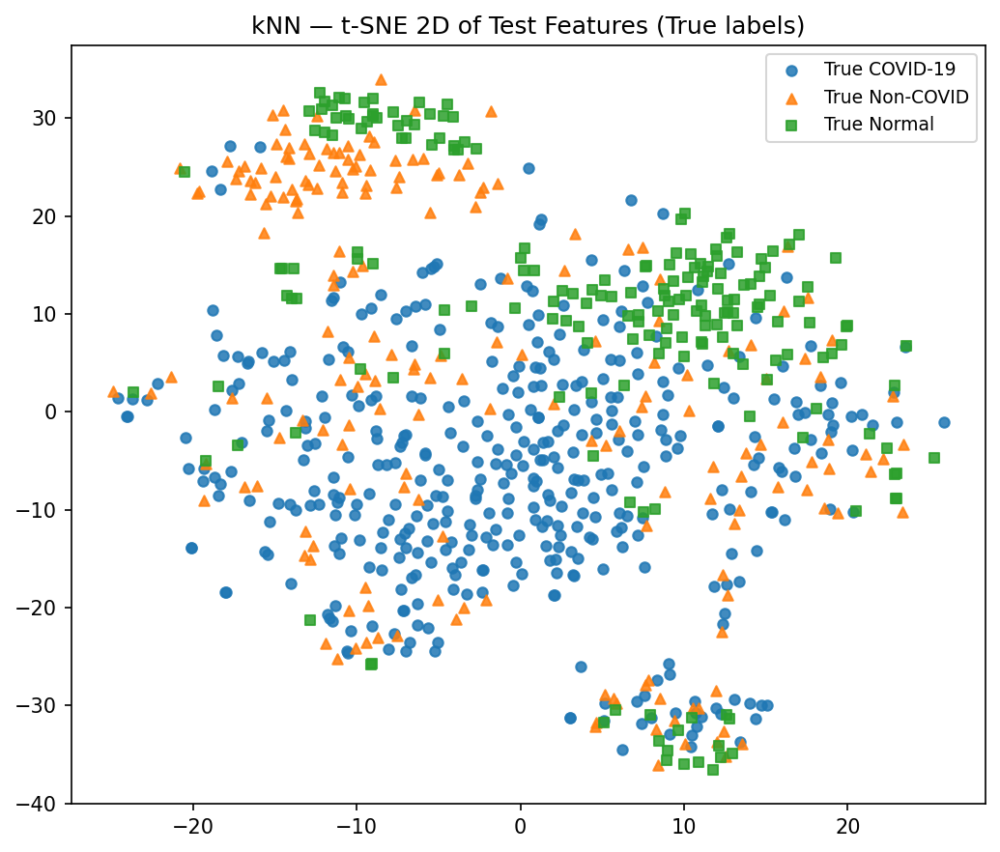

#### kNN - Nearest Neighbors Query

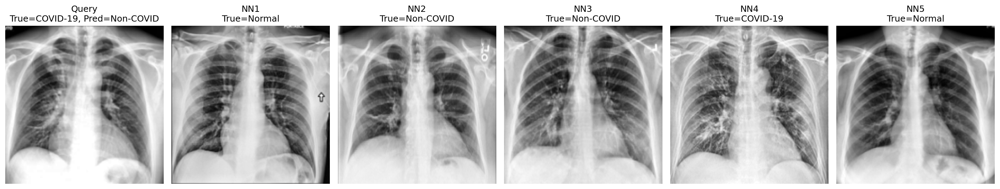

#### kNN - Sample Predictions


#### Classic Models - Accuracy Comparison

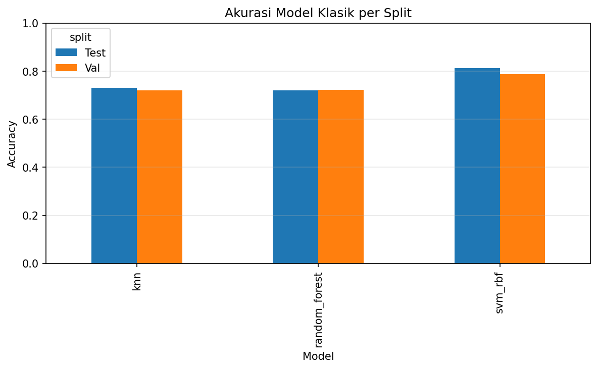

---

## 💡 Kesimpulan

### Temuan Utama

1. **HuggingFace ViT Pretrained adalah model terbaik** dengan akurasi 91.65% dan Macro F1 0.9017, mengungguli semua model termasuk SVM klasik

2. **Transfer Learning memberikan keunggulan signifikan:**
   - HF ViT Pretrained: 91.65% akurasi
   - DenseNet121 + LoRA: 82.04% akurasi
   - Keduanya mengungguli model from scratch

3. **Data Augmentation sangat penting** untuk model from scratch:
   - Custom CNN tanpa augmentation: 71.74% akurasi
   - Custom CNN dengan augmentation: 81.35% akurasi (+9.61%)

4. **Machine Learning Klasik (SVM) masih relevan** sebagai baseline yang kuat dengan akurasi 86.27% tanpa memerlukan GPU training

5. **Non-COVID Pneumonia adalah kelas paling challenging:**
   - F1 Non-COVID lebih rendah dibandingkan kelas lain di sebagian besar model
   - Hanya HF ViT dan DenseNet121 yang mencapai F1 >0.70 untuk kelas ini

6. **Trade-off Akurasi vs Efisiensi:**
   - HF ViT: Akurasi tertinggi (91.65%) namun memerlukan resources lebih besar
   - DenseNet121 + LoRA: Keseimbangan baik (82.04%) dengan efisiensi parameter
   - Custom CNN + LoRA: Sangat ringan (~1.8 MB) dengan performa 81.35% (dengan augmentation)

### Rekomendasi

- **Untuk Akurasi Maksimal:** Gunakan **HuggingFace ViT Pretrained** (91.65% akurasi)
- **Untuk Keseimbangan Performa-Efisiensi:** Gunakan **DenseNet121 + LoRA** (82.04% akurasi)
- **Untuk Deployment Mobile/Edge:** Gunakan **Custom CNN + LoRA dengan Augmentation** (81.35% akurasi, ~1.8 MB)
- **Untuk Baseline Tanpa GPU:** Gunakan **SVM dengan HOG features** (86.27% akurasi)
- **Untuk Model From Scratch:** **Selalu gunakan data augmentation** untuk performa optimal

---

## 🔮 Future Work

### 1. Dataset & Validasi

- Eksperimen dengan dataset lebih besar untuk validasi generalisasi
- Validasi klinis dengan dokter
- Cross-validation dengan multiple datasets

### 2. Optimasi Model

- Fine-tuning hyperparameter LoRA untuk optimasi lebih lanjut
- Ensemble methods menggabungkan multiple models
- Hyperparameter tuning dengan grid search atau Bayesian optimization

### 3. Arsitektur & Teknik

- Attention mechanisms untuk mengurangi false positive pada kelas Non-COVID
- Eksperimen dengan arsitektur transformer lainnya (Swin Transformer, ConvNeXt)
- Advanced augmentation (MixUp, CutMix, AutoAugment)

### 4. Optimasi Deployment

- Quantization (INT8, FP16) untuk mengurangi ukuran model
- Pruning untuk efisiensi
- Knowledge distillation
- Optimasi untuk mobile devices (TensorFlow Lite, ONNX)

### 5. Interpretability & Explainability

- Grad-CAM visualizations untuk CNN
- Attention visualization untuk ViT
- SHAP values untuk interpretability
- Uncertainty quantification

### 6. Multi-task Learning

- Joint training untuk segmentation dan classification
- Leverage lung masks dari dataset
- Severity grading untuk COVID-19

---

## 📚 Referensi

### Dataset

- **COVID-QU-Ex Dataset:** [Kaggle](https://www.kaggle.com/datasets/anasmohammedtahir/covidqu)
- Tahir, A. M., et al. "COVID-19 Infection Localization and Severity Grading from Chest X-ray Images", Computers in Biology and Medicine, vol. 139, p. 105002, 2021.

### Papers & Methods

1. **LoRA:** Hu et al., "LoRA: Low-Rank Adaptation of Large Language Models", arXiv:2106.09685, 2021
2. **Vision Transformer:** Dosovitskiy et al., "An Image is Worth 16x16 Words: Transformers for Image Recognition at Scale", arXiv:2010.11929, 2020
3. **DenseNet:** Huang et al., "Densely Connected Convolutional Networks", CVPR 2017
4. **HOG:** Dalal & Triggs, "Histograms of oriented gradients for human detection", CVPR 2005

### Tools & Libraries

- TensorFlow/Keras
- Scikit-learn
- OpenCV
- HuggingFace Transformers

---

## 📁 Struktur Proyek

```
MACHINE_LEARNING/
│
├── datasets/                          # Folder dataset (lihat README.md di dalamnya)
│   └── README.md                      # Dokumentasi dataset COVID-QU-Ex
│
├── docs/                              # Dokumentasi lengkap (MkDocs)
│   ├── about/                         # Tentang proyek
│   ├── dataset/                       # Dokumentasi dataset
│   ├── methodology/                   # Metodologi
│   ├── experiments/                   # Detail eksperimen
│   ├── results/                       # Hasil eksperimen
│   ├── usage/                         # Panduan penggunaan
│   ├── conclusions/                   # Kesimpulan
│   └── references.md                  # Referensi
│
├── output_images/                     # Hasil visualisasi dan grafik
│   ├── acc_loss_*.png                 # Grafik akurasi & loss per model
│   ├── conf_matrix_*.png              # Confusion matrix per model
│   ├── *_5_predict_true_false.png     # Visualisasi prediksi benar/salah
│   ├── benchmark_*.png                 # Grafik perbandingan antar model
│   ├── per_class_*.png                # Analisis per kelas
│   └── classic_*.png                  # Visualisasi classic ML
│
├── results/                           # Hasil eksperimen dan artifacts
│   ├── artifacts/                     # Model weights, scalers, selectors
│   └── __results___files/             # File tambahan
│
├── TASK_1:PREPROCESS+FEATEXTRACT+CLASSICMODEL.ipynb
│   └── Preprocessing, HOG Feature Extraction, Classic ML Models (SVM, RF, KNN)
│
├── TASK_2:CNN+LoRA.ipynb
│   └── Custom CNN Architecture + LoRA Implementation
│
├── TASK_3:PretrainedDenseNet+ViT+Augmentation+LoRA.ipynb
│   └── Transfer Learning (DenseNet121), Vision Transformer, Data Augmentation
│
├── TASK_FINAL:ML_TASK.ipynb          # Task final
│
├── POSTER_MACHINE_LEARNING.png        # Poster penelitian
├── Laporan_Machine_Learning_v3.pdf    # Laporan lengkap penelitian
├── mkdocs.yml                         # Konfigurasi MkDocs
├── requirements-docs.txt              # Dependencies untuk dokumentasi
│
└── README.md                          # File ini
```

---

## 📄 Lisensi

Proyek ini dibuat untuk keperluan akademik. Dataset COVID-QU-Ex memiliki lisensi **CC BY-SA 4.0** (Creative Commons Attribution-ShareAlike 4.0).

---

## 📧 Kontak

- **Muhammad Hisyam Kamil:** hisyamkamil99@webmail.umm.ac.id
- **Elga Putri Tri Farma:** elgafarma@webmail.umm.ac.id

---

## 📚 Dokumentasi

Dokumentasi lengkap proyek ini tersedia dalam format **Material for MkDocs** yang dapat diakses secara online atau dibangun secara lokal.

### 🌐 Dokumentasi Online

Dokumentasi tersedia di: **https://hisyam99.github.io/MACHINE_LEARNING_PROJECT/**

### 🏗️ Membangun Dokumentasi Lokal

#### Prerequisites

```bash
pip install -r requirements-docs.txt
```

#### Build & Serve

```bash
# Build dokumentasi
mkdocs build

# Serve lokal (dengan auto-reload)
mkdocs serve

# Buka browser di http://127.0.0.1:8000
```

#### Deploy ke GitHub Pages

Dokumentasi akan otomatis di-deploy ke GitHub Pages ketika:
- Push ke branch `main` atau `master`
- File di folder `docs/` atau `mkdocs.yml` berubah
- GitHub Actions workflow berhasil dijalankan

Untuk deploy manual:
```bash
mkdocs gh-deploy
```

### 📁 Struktur Dokumentasi

```
docs/
├── index.md                    # Halaman utama
├── about/                      # Tentang proyek
│   ├── overview.md
│   ├── team.md
│   └── objectives.md
├── dataset/                    # Dokumentasi dataset
│   ├── introduction.md
│   ├── statistics.md
│   ├── preprocessing.md
│   └── citation.md
├── methodology/               # Metodologi
│   ├── preprocessing.md
│   ├── classic-ml.md
│   ├── custom-cnn.md
│   ├── transfer-learning.md
│   └── lora.md
├── experiments/               # Detail eksperimen
│   ├── task1-classic-ml.md
│   ├── task2-cnn-lora.md
│   └── task3-pretrained.md
├── results/                    # Hasil eksperimen
│   ├── overview.md
│   ├── comparison.md
│   ├── analysis.md
│   └── visualizations.md
├── usage/                      # Panduan penggunaan
│   ├── installation.md
│   ├── quickstart.md
│   └── notebooks.md
├── conclusions/                # Kesimpulan
│   ├── summary.md
│   ├── recommendations.md
│   └── future-work.md
└── references.md              # Referensi
```

### 🎨 Fitur Dokumentasi

- ✅ **Material Design** - UI modern dan responsif
- ✅ **Dark Mode** - Tema gelap untuk kenyamanan mata
- ✅ **Search** - Pencarian cepat di seluruh dokumentasi
- ✅ **Navigation** - Navigasi yang mudah dan intuitif
- ✅ **Code Highlighting** - Syntax highlighting untuk code blocks
- ✅ **Responsive** - Mobile-friendly
- ✅ **Auto-deploy** - Otomatis deploy ke GitHub Pages via GitHub Actions

---

**Last Updated:** November 2025
