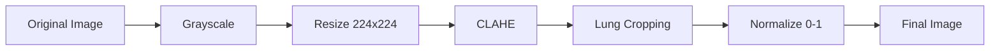

# Preprocessing Dataset

## 🔄 Pipeline Preprocessing

Pipeline preprocessing yang diterapkan pada semua citra dalam proyek ini:



## 📝 Langkah-langkah Preprocessing

### 1. Grayscale Conversion

Konversi citra berwarna ke skala abu-abu untuk mengurangi dimensi dan fokus pada struktur paru.

```python
img = cv2.imread(path, cv2.IMREAD_GRAYSCALE)
```

### 2. Resize

Standarisasi ukuran menjadi `224×224` piksel untuk konsistensi input model.

```python
img = cv2.resize(img, (224, 224), interpolation=cv2.INTER_AREA)
```

**Alasan:** Ukuran 224×224 adalah standar untuk banyak arsitektur deep learning (ImageNet standard).

### 3. CLAHE (Contrast Limited Adaptive Histogram Equalization)

Meningkatkan kontras lokal untuk menonjolkan struktur paru.

**Parameter:**
- **Clip Limit:** 2.0
- **Tile Grid Size:** 8×8

```python
clahe = cv2.createCLAHE(clipLimit=2.0, tileGridSize=(8, 8))
img = clahe.apply(img)
```

**Alasan:** CLAHE lebih baik daripada histogram equalization global karena:
- Mencegah over-amplification noise
- Meningkatkan kontras lokal tanpa merusak area yang sudah kontras baik
- Menonjolkan detail struktur paru yang penting untuk deteksi

### 4. Heuristic Lung Cropping

Otomatis crop area paru-paru menggunakan thresholding & connected components.

**Algoritma:**
1. Threshold citra menggunakan Otsu's method
2. Deteksi connected components
3. Pilih 2 komponen terbesar (kiri dan kanan paru)
4. Crop area dengan padding 20 piksel
5. Resize kembali ke 224×224

```python
def heuristic_lung_crop(img01, padding=20):
    H, W = img01.shape
    u8 = (img01 * 255).astype(np.uint8)
    _, m = cv2.threshold(u8, 0, 255, cv2.THRESH_BINARY_INV + cv2.THRESH_OTSU)
    num, lab = cv2.connectedComponents(m)
    
    # Pilih 2 komponen terbesar
    areas = sorted([(k, int((lab == k).sum())) for k in range(1, num)], 
                   key=lambda x: x[1], reverse=True)
    keep_areas = areas[:2]
    
    # Buat mask
    mask = np.zeros_like(m, dtype=np.uint8)
    for k, _ in keep_areas:
        mask[lab == k] = 255
    
    # Crop dengan padding
    ys, xs = np.where(mask > 0)
    x0, x1 = max(0, xs.min() - padding), min(W - 1, xs.max() + padding)
    y0, y1 = max(0, ys.min() - padding), min(H - 1, ys.max() + padding)
    crop = img01[y0:y1+1, x0:x1+1]
    
    return cv2.resize(crop, (224, 224), interpolation=cv2.INTER_AREA)
```

**Alasan:** 
- Menghilangkan area non-paru (background, kabel, dll)
- Fokus pada area yang relevan untuk deteksi
- Meningkatkan efisiensi komputasi

### 5. Normalisasi

Skala piksel ke rentang `[0, 1]` untuk stabilitas numerik.

```python
img = img.astype(np.float32) / 255.0
```

**Alasan:**
- Stabilitas numerik untuk training deep learning
- Konsistensi dengan pretrained models (ImageNet normalization)
- Mempercepat konvergensi

## 🖼️ Visualisasi Preprocessing

Berikut adalah contoh visualisasi hasil preprocessing:

| Langkah | Deskripsi |
|:--------|:----------|
| **Original** | Citra X-Ray asli (resized) |
| **CLAHE** | Setelah Contrast Limited Adaptive Histogram Equalization |
| **Final** | Setelah CLAHE + Normalisasi (siap untuk training) |

## ⚙️ Implementasi

### Fungsi Lengkap

```python
import cv2
import numpy as np

def apply_clahe(img01):
    """Apply CLAHE to normalized image."""
    u8 = (img01 * 255).astype(np.uint8)
    clahe = cv2.createCLAHE(clipLimit=2.0, tileGridSize=(8, 8))
    eq = clahe.apply(u8)
    return eq.astype(np.float32) / 255.0

def heuristic_lung_crop(img01, padding=20):
    """Crop lung area using heuristic method."""
    H, W = img01.shape
    u8 = (img01 * 255).astype(np.uint8)
    _, m = cv2.threshold(u8, 0, 255, cv2.THRESH_BINARY_INV + cv2.THRESH_OTSU)
    num, lab = cv2.connectedComponents(m)
    
    if num <= 1:
        return cv2.resize(img01, (224, 224), interpolation=cv2.INTER_AREA)
    
    areas = sorted([(k, int((lab == k).sum())) for k in range(1, num)], 
                   key=lambda x: x[1], reverse=True)
    keep_areas = areas[:2]
    
    mask = np.zeros_like(m, dtype=np.uint8)
    for k, _ in keep_areas:
        mask[lab == k] = 255
    
    ys, xs = np.where(mask > 0)
    if len(xs) == 0 or len(ys) == 0:
        return cv2.resize(img01, (224, 224), interpolation=cv2.INTER_AREA)
    
    x0, x1 = max(0, xs.min() - padding), min(W - 1, xs.max() + padding)
    y0, y1 = max(0, ys.min() - padding), min(H - 1, ys.max() + padding)
    crop = img01[y0:y1+1, x0:x1+1]
    
    return cv2.resize(crop, (224, 224), interpolation=cv2.INTER_AREA)

def load_and_preprocess(path, size=(224, 224)):
    """Load and preprocess image."""
    img = cv2.imread(str(path), cv2.IMREAD_GRAYSCALE)
    if img is None:
        raise FileNotFoundError(path)
    
    # Resize
    img = cv2.resize(img, size, interpolation=cv2.INTER_AREA)
    
    # Normalize
    img = img.astype(np.float32) / 255.0
    
    # CLAHE
    img = apply_clahe(img)
    
    # Lung cropping
    img = heuristic_lung_crop(img)
    
    return img
```

## 📊 Perbandingan Sebelum dan Sesudah

### Manfaat Preprocessing

1. **CLAHE:**
   - ✅ Meningkatkan kontras struktur paru
   - ✅ Menonjolkan detail penting untuk deteksi
   - ✅ Mengurangi efek variasi pencahayaan

2. **Lung Cropping:**
   - ✅ Fokus pada area relevan
   - ✅ Mengurangi noise dari background
   - ✅ Meningkatkan efisiensi komputasi

3. **Normalisasi:**
   - ✅ Stabilitas numerik
   - ✅ Konsistensi dengan pretrained models
   - ✅ Mempercepat konvergensi

## 🔗 Referensi

- [OpenCV CLAHE Documentation](https://docs.opencv.org/4.x/d6/dc7/group__imgproc__hist.html#ga7e54091f0c937d49bf84152a16df76e6)
- [Otsu's Method](https://en.wikipedia.org/wiki/Otsu%27s_method)

