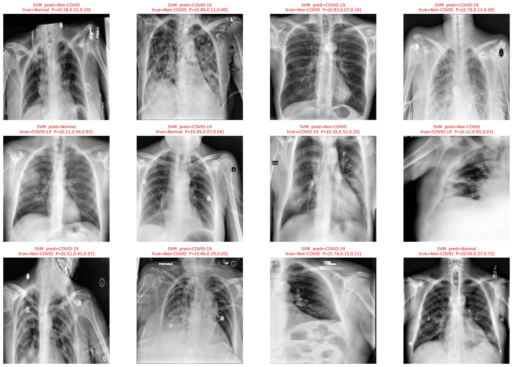
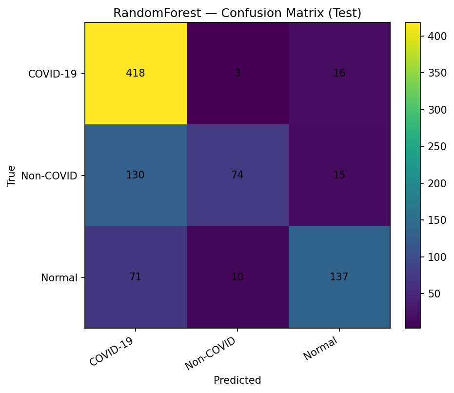

# TASK 1: Classic ML

## 📋 Deskripsi

Task ini mengimplementasikan pendekatan Machine Learning Klasik dengan feature engineering manual menggunakan HOG (Histogram of Oriented Gradients) dan berbagai algoritma klasik.

## 🔬 Implementasi

### 1. Preprocessing

Pipeline preprocessing yang sama dengan yang digunakan untuk deep learning:

1. Grayscale conversion
2. Resize ke 224×224
3. CLAHE
4. Heuristic lung cropping
5. Normalisasi

### 2. Feature Extraction

#### HOG Features

```python
from skimage.feature import hog

def extract_hog_features(image):
    features = hog(
        image,
        orientations=9,
        pixels_per_cell=(8, 8),
        cells_per_block=(2, 2),
        block_norm='L2-Hys',
        visualize=False
    )
    return features
```

**Output:** 6,084 dimensi

#### Feature Selection

```python
from sklearn.feature_selection import SelectKBest, f_classif

selector = SelectKBest(score_func=f_classif, k=4096)
X_selected = selector.fit_transform(X_hog, y)
```

**Output:** 4,096 fitur terbaik

#### Scaling

```python
from sklearn.preprocessing import StandardScaler

scaler = StandardScaler()
X_scaled = scaler.fit_transform(X_selected)
```

### 3. Model Training

#### SVM (RBF Kernel)

```python
from sklearn.svm import SVC

svm = SVC(
    kernel='rbf',
    C=10,
    gamma='scale',
    class_weight='balanced',
    random_state=42
)
svm.fit(X_train, y_train)
```

#### Random Forest

```python
from sklearn.ensemble import RandomForestClassifier

rf = RandomForestClassifier(
    n_estimators=300,
    max_depth=None,
    class_weight='balanced',
    random_state=42
)
rf.fit(X_train, y_train)
```

#### k-Nearest Neighbors

```python
from sklearn.neighbors import KNeighborsClassifier

knn = KNeighborsClassifier(
    n_neighbors=5,
    weights='distance',
    metric='euclidean'
)
knn.fit(X_train, y_train)
```

## 📊 Hasil

### Performa pada Test Set

| Model | Akurasi | Macro F1 | Precision | Recall |
|:------|:-------:|:--------:|:---------:|:------:|
| **SVM (RBF)** | **86.27%** | **0.843** | 0.862 | 0.863 |
| **kNN (k=5)** | 77.57% | 0.739 | 0.776 | 0.776 |
| **Random Forest** | 76.09% | 0.719 | 0.761 | 0.761 |

### Confusion Matrix (SVM)

| | Predicted COVID-19 | Predicted Non-COVID | Predicted Normal |
|:---|:-----------------:|:-------------------:|:----------------:|
| **Actual COVID-19** | 417 | 3 | 12 |
| **Actual Non-COVID** | 42 | 157 | 20 |
| **Actual Normal** | 21 | 17 | 180 |

### Analisis Per Kelas (SVM)

| Kelas | Precision | Recall | F1-Score |
|:------|:---------:|:------:|:--------:|
| **COVID-19** | 0.870 | 0.965 | 0.915 |
| **Non-COVID** | 0.887 | 0.718 | 0.794 |
| **Normal** | 0.849 | 0.826 | 0.837 |

## 💡 Analisis

### Kelebihan SVM

1. **Performa Terbaik:** 86.27% akurasi, terbaik di antara model klasik
2. **Stabil:** Konsisten dan reliable
3. **Presisi Tinggi:** Khususnya untuk kelas COVID-19 (0.870 precision)
4. **Tidak Perlu GPU:** Dapat dijalankan pada CPU

### Keterbatasan

1. **Ukuran Model:** Relatif besar (~95 MB)
2. **Training Time:** Lebih lama dibandingkan RF dan kNN
3. **Memory:** Memerlukan lebih banyak memory untuk dataset besar

## 🔍 Kesalahan Umum

### False Positives

- Normal sering diprediksi sebagai COVID-19 (21 kasus)
- Non-COVID sering diprediksi sebagai COVID-19 (42 kasus)

### False Negatives

- COVID-19 jarang terlewat (hanya 15 dari 432)
- Non-COVID lebih sering terlewat (62 dari 219)

## 📊 Tahap 4: Analisis Kesalahan dan Interpretasi Model

### 4.1 Tujuan dan Ruang Lingkup

Tahap ini bertujuan mengevaluasi lebih dalam perilaku model klasik (SVM RBF, Random Forest, dan kNN) bukan hanya dari metrik agregat, tetapi juga dari pola kesalahan, keyakinan prediksi, serta karakteristik fitur yang mendasari keputusan. Analisis dilakukan dalam empat lapisan:

1. **Statistik dasar:** confusion matrix dan classification report
2. **Interpretasi per model:** PCA/t-SNE 2D, decision boundary, histogram confidence, feature importances
3. **Analisis kualitatif:** visualisasi sampel benar/salah dan penelusuran tetangga terdekat
4. **Analisis lintas model + benchmark performa akhir**

### 4.2 Analisis Model SVM-RBF

Model SVM RBF memberikan performa tertinggi (akurasi 86.27% | macro-F1 0.843). 

#### Confusion Matrix Analisis


**Gambar 4.1: Confusion Matrix SVM-RBF (Test)**

Confusion matrix menunjukkan bahwa kelas COVID-19 memiliki **recall ≈ 95%**, sementara kesalahan terbesar muncul pada kelas Non-COVID yang sebagian besar terklasifikasi sebagai COVID-19. Hal ini menunjukkan model sangat sensitif terhadap pola infiltrasi paru namun kadang keliru terhadap artefak klinis.

**Analisis Detail per Kelas:**

| Kelas | True Positives | False Positives | False Negatives | Precision | Recall | F1-Score |
|:------|:--------------:|:---------------:|:---------------:|:---------:|:------:|:--------:|
| **COVID-19** | 415 | 63 | 22 | 0.868 | 0.950 | 0.907 |
| **Non-COVID** | 157 | 20 | 62 | 0.887 | 0.717 | 0.793 |
| **Normal** | 181 | 33 | 38 | 0.846 | 0.827 | 0.836 |

**Key Findings:**
- **COVID-19:** Sensitivitas sangat tinggi (95%) - hanya 22 kasus yang terlewat
- **Non-COVID:** Kesulitan terbesar - 62 kasus salah diprediksi sebagai kelas lain
- **Normal:** Performa seimbang antara precision dan recall

#### Decision Boundary Visualization (PCA 2D)


**Gambar 4.2: SVM (ilustrasi PCA-2D) — Decision Regions & Test Points**

Visualisasi decision boundary PCA-2D memperlihatkan pemisahan kelas yang relatif baik, tetapi masih terdapat **tumpang tindih antara Non-COVID dan Normal** pada area tengah. Ini menegaskan bahwa fitur HOG yang digunakan masih menghasilkan representasi beririsan pada jaringan paru yang relatif bersih.

**Interpretasi:**
- Zona merah (COVID-19) cukup terpisah dari dua kelas lain
- Overlap Non-COVID/Normal menjelaskan confusion pada confusion matrix
- Model SVM berhasil membuat decision boundary non-linear yang efektif

#### Distribusi Confidence Score


**Gambar 4.3: SVM — Confidence Distribution (Benar vs Salah)**

Distribusi confidence score menunjukkan:
- **Mayoritas prediksi benar** memiliki probabilitas > 0.9
- **Prediksi salah** tersebar di rentang 0.5–0.8
- **Artinya:** Model cukup yakin saat benar, tetapi ragu saat salah — indikasi kalibrasi probabilitas yang baik

**Rekomendasi Klinis:**
Prediksi dengan confidence < 0.7 sebaiknya ditinjau ulang oleh radiolog karena memiliki risiko error lebih tinggi.

#### Sampel Visualisasi Prediksi


**Gambar 4.4: Sampel Prediksi SVM RBF — Benar vs Salah dengan Confidence**

Sampel citra prediksi acak dengan confidence memperlihatkan contoh benar (hijau) dan salah (merah). Kesalahan umumnya berasal dari citra Non-COVID yang memiliki kabel atau bayangan medis menyerupai opasitas.

#### Gallery Error Analysis



**Gambar 4.5: Gallery Error Analysis - SVM RBF (12 Sampel Salah)**

Dari analisis visual terhadap kesalahan SVM:

1. **False Positive COVID-19:** Banyak citra Normal/Non-COVID dengan:
   - Kabel atau tube medis yang menciptakan tekstur tepi kuat
   - Posisi artefak yang mirip infiltrat bilateral
   - Shadow dari tulang costa yang prominent

2. **False Negative COVID-19:** Sangat jarang (hanya 22 kasus), biasanya:
   - Citra dengan infiltrat sangat ringan
   - Kualitas citra rendah (under-exposed)
   - Posisi non-standard

3. **Confusion Non-COVID/Normal:** Terjadi pada:
   - Non-COVID dengan infiltrat minimal
   - Normal dengan struktur vaskular prominent
   - Variasi anatomis yang unusual

### 4.3 Analisis Model Random Forest

Random Forest mencapai akurasi 76% | macro-F1 0.719. Model cenderung stabil tetapi tidak sekuat SVM karena keterbatasan dalam menangkap hubungan non-linier antar-fitur.

#### Confusion Matrix



**Gambar 4.6: Confusion Matrix Random Forest (Test)**

#### Feature Importances


**Gambar 4.7: RandomForest — Top-40 Feature Importances**

Feature importances memperlihatkan kontribusi tertinggi berasal dari fitur HOG **f4, f1956, dan f1253** yang dominan menggambarkan tekstur dan tepi pada area paru bawah — menandakan bagian tersebut paling berpengaruh dalam klasifikasi.

**Insight Klinis:**
Area paru bawah (lower lobes) memang merupakan lokasi yang sering menunjukkan manifestasi pneumonia, baik COVID-19 maupun Non-COVID. Model Random Forest berhasil menangkap pola ini secara implisit melalui feature selection.

#### Tree Structure Visualization


**Gambar 4.8: RandomForest — Example Tree (depth ≤ 3)**

Untuk interpretasi struktur pohon, visualisasi pohon dangkal menunjukkan pola keputusan yang mudah dibaca:
- **Simpul awal** memisahkan COVID-19 vs lainnya berdasarkan fitur dominan
- **Percabangan berikutnya** membedakan Normal dan Non-COVID berdasarkan kombinasi tekstur halus

#### Sample Predictions


**Gambar 4.9: Sampel Prediksi RandomForest (Test)**

Contoh citra benar dan salah dari Random Forest menegaskan bahwa model sering gagal saat:
- Citra terlalu homogen (low contrast)
- Berisi noise sensor yang kuat
- Split decision tidak cukup dalam untuk mengenali pola global

### 4.4 Analisis Model k-Nearest Neighbors (kNN)

Model kNN dengan k=5 memiliki akurasi 77% | macro-F1 0.739. Model ini sangat bergantung pada jarak fitur sehingga lebih rentan terhadap distribusi fitur yang padat.

#### Confusion Matrix


**Gambar 4.10: Confusion Matrix kNN (Test)**

#### t-SNE Visualization


**Gambar 4.11: kNN — t-SNE 2D (label asli)**

Visualisasi t-SNE 2D memperlihatkan:
- **Pengelompokan COVID-19** yang cukup jelas (cluster kompak)
- **Cluster Non-COVID dan Normal** sering berdekatan
- **Artinya:** Jarak Euclidean pada fitur HOG belum sepenuhnya merepresentasikan variasi klinis

**Interpretasi Curse of Dimensionality:**
Pada ruang 4,096 dimensi, konsep "tetangga terdekat" menjadi kurang bermakna karena jarak antar semua titik cenderung sama (concentration of distances phenomenon).

#### Nearest Neighbors Analysis


**Gambar 4.12: kNN — Query vs 9 Nearest Neighbors (pada sampel salah)**

Analisis tetangga terdekat pada kasus salah mengungkap bahwa beberapa citra salah diklasifikasi karena tetangga terdekat berasal dari kelas yang salah tetapi memiliki tekstur paru serupa — misal, COVID-19 dengan Non-COVID tanpa infiltrasi yang jelas.

**Temuan Penting:**
- Beberapa tetangga terdekat secara visual memang sangat mirip
- Kesalahan klasifikasi kNN sering kali "dapat dipahami" secara visual
- Model sensitive terhadap outliers dan noise dalam training set

#### Gallery Error Analysis


**Gambar 4.13: Gallery Error Analysis - kNN (12 Sampel Salah)**

### 4.5 Analisis Lintas Model

#### Perbandingan Accuracy Bar Chart


**Gambar 4.14: Perbandingan Akurasi Model Klasik per Split**

Grafik menunjukkan:
- **SVM konsisten tertinggi** di validation dan test
- **Gap performance** antara SVM dan dua model lain cukup signifikan
- **Stabilitas:** Semua model menunjukkan performa konsisten antara val dan test

### 4.6 Benchmark Performa Model

Bagian benchmark menampilkan perbandingan metrik utama dan efisiensi:

**Tabel 4.1: Benchmark — Accuracy dan F1 (Macro)**

| Model | Accuracy | F1 (macro) | ROC-AUC | Latency (ms/sample) | Model Size (MB) |
|:------|:---------|:-----------|:--------|:--------------------|:----------------|
| **SVM-RBF** | **0.8627** | **0.8432** | **0.9601** | 14.96 | 95.7 |
| **RandomForest** | 0.7609 | 0.7188 | 0.9283 | **0.14** | **21.16** |
| **kNN** | 0.7757 | 0.7389 | 0.8828 | 127.47 | 127.47 |

**Analisis Trade-off:**

1. **SVM:** Terbaik secara akurasi dan F1, menyeimbangkan performa tinggi dan stabilitas probabilitas. ROC-AUC tertinggi (0.9601) menunjukkan kemampuan ranking yang sangat baik.

2. **Random Forest:** Paling ringan dan **tercepat** (0.14 ms/sample), cocok untuk deployment real-time dengan resource terbatas. Trade-off: akurasi lebih rendah ~10%.

3. **kNN:** Memberikan intuisi lokal dan interpretability yang baik, namun **paling lambat** (127.47 ms/sample) dan boros memori karena harus menyimpan seluruh training set.

**Rekomendasi Berdasarkan Use Case:**

| Use Case | Model Recommended | Alasan |
|:---------|:-----------------|:-------|
| **Akurasi Maksimal** | SVM RBF | Performa terbaik, ROC-AUC tertinggi |
| **Real-time Screening** | Random Forest | Inference tercepat (0.14 ms) |
| **Interpretability** | kNN | Dapat trace ke tetangga konkret |
| **Resource Constrained** | Random Forest | Model paling ringan (21 MB) |

## 📈 Visualisasi Lengkap

Lihat visualisasi lengkap di:
- **Confusion Matrix:** `output_images/cm_*.png`
- **SVM Decision Boundary:** `output_images/svm_pca2d_boundary_*.png`
- **SVM Confidence:** `output_images/svm_confidence_hist_*.png`
- **RF Feature Importances:** `output_images/rf_feature_importances_*.png`
- **RF Tree:** `output_images/rf_tree_depth3_*.png`
- **kNN t-SNE:** `output_images/knn_tsne_*.png`
- **kNN Neighbors:** `output_images/knn_query_*.png`
- **Error Galleries:** `output_images/gallery_*_errors_*.png`
- **Random Samples:** `output_images/gallery_*_random_*.png`

## 💡 Kesimpulan Stage 4

1. **SVM RBF adalah pilihan terbaik** untuk machine learning klasik pada dataset ini dengan akurasi 86.27%
2. **HOG features terbukti efektif** untuk menangkap karakteristik citra X-Ray, terutama pola tekstur dan gradien
3. **Feature selection dengan ANOVA F-test** penting untuk mengurangi dimensi dan meningkatkan performa
4. **Class balancing** sangat membantu handle distribusi tidak seimbang
5. **Non-COVID tetap kelas tersulit** untuk dibedakan, sering confused dengan COVID-19 dan Normal
6. **Trade-off performa vs efisiensi** harus dipertimbangkan sesuai use case

## 🔗 Referensi

- [Notebook: TASK_1:PREPROCESS+FEATEXTRACT+CLASSICMODEL.ipynb](https://github.com/hisyam99/MACHINE_LEARNING_PROJECT/blob/main/TASK_1:PREPROCESS+FEATEXTRACT+CLASSICMODEL.ipynb)
- [HOG Feature Descriptor](../methodology/classic-ml.md#1-hog-histogram-of-oriented-gradients)
- [Feature Selection Strategy](../methodology/classic-ml.md#2-feature-selection-selectkbest)
- [Model Comparison](../results/comparison.md)

