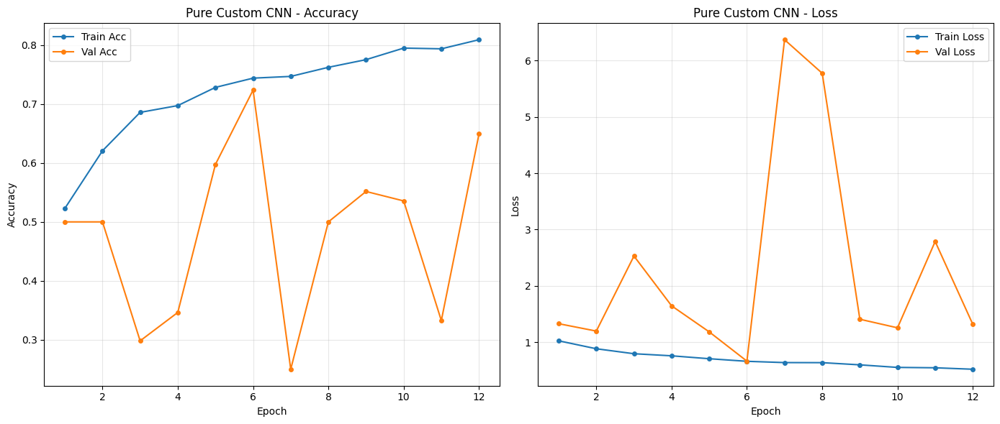
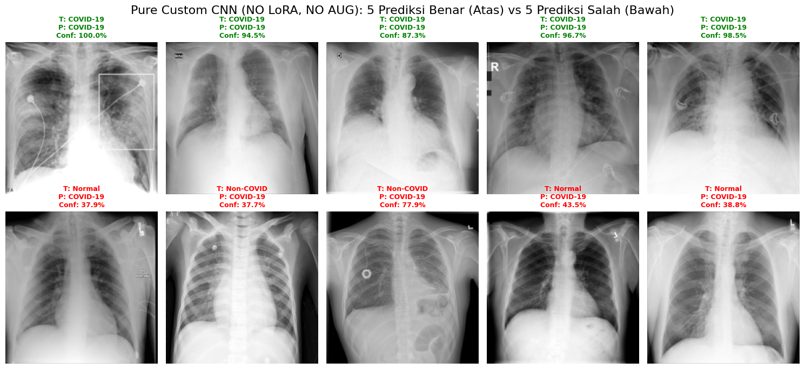
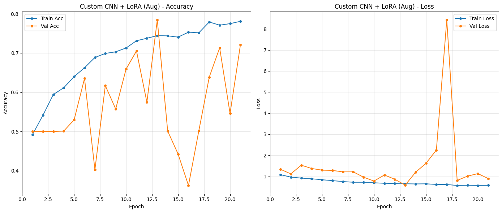

# TASK 2: Custom CNN + LoRA

## 📋 Deskripsi

Task ini mengimplementasikan Custom CNN dari scratch dengan arsitektur 4 blok konvolusi dan LoRA (Low-Rank Adaptation) untuk efisiensi parameter. Setelah mengeksplorasi pendekatan machine learning klasik pada Tahap 1-4, tahap selanjutnya adalah menerapkan Deep Learning menggunakan Convolutional Neural Network (CNN). Berbeda dengan pendekatan sebelumnya yang memisahkan ekstraksi fitur (HOG) dan klasifikasi, CNN melakukan pembelajaran fitur secara **end-to-end**.

## 🎯 Latar Belakang dan Motivasi

Pada eksperimen ini, kami membangun arsitektur Custom CNN dari nol (from scratch) yang dipadukan dengan teknik Low-Rank Adaptation (LoRA) pada lapisan fully-connected. Tujuannya adalah menciptakan model yang:

1. **Ringan (parameter efisien):** Cocok untuk deployment pada perangkat dengan resource terbatas
2. **Mampu menangkap pola spasial:** Belajar langsung dari citra X-ray tanpa feature engineering manual
3. **Stabil pada dataset terbatas:** Menggunakan teknik regularisasi untuk mencegah overfitting
4. **Efisien secara komputasi:** Training time yang reasonable tanpa memerlukan resource GPU besar

## 🏗️ Arsitektur Model Custom CNN

### Model Structure (Diagram Lengkap)

```
Input (224×224×1) - Grayscale X-Ray Image
    ↓
┌─────────────────────────────────────┐
│   Conv Block 1 (32 filters, 3×3)   │
│   • Conv2D(32, 3×3, padding='same') │
│   • BatchNormalization()            │
│   • ReLU()                          │
│   • MaxPooling2D(2×2)               │
│   Output: 112×112×32                │
└─────────────────────────────────────┘
    ↓
┌─────────────────────────────────────┐
│   Conv Block 2 (64 filters, 3×3)   │
│   • Conv2D(64, 3×3, padding='same') │
│   • BatchNormalization()            │
│   • ReLU()                          │
│   • MaxPooling2D(2×2)               │
│   Output: 56×56×64                  │
└─────────────────────────────────────┘
    ↓
┌─────────────────────────────────────┐
│   Conv Block 3 (128 filters, 3×3)  │
│   • Conv2D(128, 3×3, padding='same')│
│   • BatchNormalization()            │
│   • ReLU()                          │
│   • MaxPooling2D(2×2)               │
│   Output: 28×28×128                 │
└─────────────────────────────────────┘
    ↓
┌─────────────────────────────────────┐
│   Conv Block 4 (256 filters, 3×3)  │
│   • Conv2D(256, 3×3, padding='same')│
│   • BatchNormalization()            │
│   • ReLU()                          │
│   • MaxPooling2D(2×2)               │
│   Output: 14×14×256                 │
└─────────────────────────────────────┘
    ↓
Global Average Pooling
    ↓ (Flatten spatial dimensions)
    256-dimensional feature vector
    ↓
Dropout (0.5)
    ↓
LoRA Dense (128 units, rank=4, alpha=32)
    ↓ ReLU
Dropout (0.3)
    ↓
LoRA Dense (3 units, rank=4, alpha=32)
    ↓ Softmax
Output (3 classes: COVID-19, Non-COVID, Normal)
```

### Spesifikasi Parameter

- **Total Parameters:** ~405,731 parameter
- **Trainable Parameters:** ~405,731 parameter (100% trainable)
- **Model Size:** ~1.8 MB (sangat lightweight)
- **Input Shape:** (224, 224, 1)
- **Output Shape:** (3,) dengan softmax activation

**Perbandingan dengan Model Lain:**
- DenseNet121 pre-trained: ~7-8 juta parameter
- ResNet50: ~25 juta parameter
- Custom CNN + LoRA: **~400K parameter** (98% lebih kecil!)

### Design Rationale

**Mengapa 4 Blok Konvolusi?**

1. **Hierarchical Feature Learning:**
   - Block 1 (32 filters): Menangkap low-level features (edges, textures)
   - Block 2 (64 filters): Menangkap mid-level features (patterns, shapes)
   - Block 3 (128 filters): Menangkap high-level features (structures)
   - Block 4 (256 filters): Menangkap complex features (disease patterns)

2. **Progressive Downsampling:**
   - Setiap MaxPooling mengurangi spatial dimension 2x
   - Mempertahankan informasi penting sambil mengurangi komputasi
   - Receptive field yang semakin besar untuk menangkap konteks global

3. **Filter Doubling Strategy:**
   - Jumlah filter digandakan setiap blok (32→64→128→256)
   - Mengkompensasi reduksi spatial dimension
   - Meningkatkan kapasitas representasi pada layer dalam

**Mengapa Global Average Pooling?**

- **Regularisasi:** Mengurangi overfitting dibanding Flatten + Dense
- **Spatial Invariance:** Robust terhadap translasi objek dalam gambar
- **Reduksi Parameter:** Tidak ada parameter tambahan
- **Interpretability:** Feature maps dapat divisualisasi dengan lebih mudah

## 🔬 Implementasi Detail

### Model Definition

```python
import tensorflow as tf
from tensorflow.keras import layers, models

def build_custom_cnn_with_lora():
    """
    Custom CNN dengan LoRA untuk klasifikasi COVID-19 X-Ray.
    
    Returns:
        model: Keras Sequential model dengan LoRA layers
    """
    model = models.Sequential([
        # Conv Block 1: Low-level features
        layers.Conv2D(32, (3, 3), padding='same', 
                     input_shape=(224, 224, 1),
                     kernel_initializer='he_normal',
                     name='conv1'),
        layers.BatchNormalization(name='bn1'),
        layers.ReLU(name='relu1'),
        layers.MaxPooling2D((2, 2), name='pool1'),
        
        # Conv Block 2: Mid-level features
        layers.Conv2D(64, (3, 3), padding='same',
                     kernel_initializer='he_normal',
                     name='conv2'),
        layers.BatchNormalization(name='bn2'),
        layers.ReLU(name='relu2'),
        layers.MaxPooling2D((2, 2), name='pool2'),
        
        # Conv Block 3: High-level features
        layers.Conv2D(128, (3, 3), padding='same',
                     kernel_initializer='he_normal',
                     name='conv3'),
        layers.BatchNormalization(name='bn3'),
        layers.ReLU(name='relu3'),
        layers.MaxPooling2D((2, 2), name='pool3'),
        
        # Conv Block 4: Complex features
        layers.Conv2D(256, (3, 3), padding='same',
                     kernel_initializer='he_normal',
                     name='conv4'),
        layers.BatchNormalization(name='bn4'),
        layers.ReLU(name='relu4'),
        layers.MaxPooling2D((2, 2), name='pool4'),
        
        # Global Average Pooling (regularization)
        layers.GlobalAveragePooling2D(name='gap'),
        
        # Dropout for regularization
        layers.Dropout(0.5, name='dropout1'),
        
        # LoRA Dense Layers
        LoRADense(128, rank=4, alpha=32, name='lora_dense1'),
        layers.ReLU(name='relu_dense'),
        layers.Dropout(0.3, name='dropout2'),
        LoRADense(3, rank=4, alpha=32, activation='softmax', name='output')
    ])
    
    return model

# Build model
model = build_custom_cnn_with_lora()

# Print summary
model.summary()
```

**Output Model Summary:**

```
Model: "sequential"
_________________________________________________________________
 Layer (type)                Output Shape              Param #   
=================================================================
 conv1 (Conv2D)              (None, 224, 224, 32)      320       
 bn1 (BatchNormalization)    (None, 224, 224, 32)      128       
 relu1 (ReLU)                (None, 224, 224, 32)      0         
 pool1 (MaxPooling2D)        (None, 112, 112, 32)      0         
 
 conv2 (Conv2D)              (None, 112, 112, 64)      18496     
 bn2 (BatchNormalization)    (None, 112, 112, 64)      256       
 relu2 (ReLU)                (None, 112, 112, 64)      0         
 pool2 (MaxPooling2D)        (None, 56, 56, 64)        0         
 
 conv3 (Conv2D)              (None, 56, 56, 128)       73856     
 bn3 (BatchNormalization)    (None, 56, 56, 128)       512       
 relu3 (ReLU)                (None, 56, 56, 128)       0         
 pool3 (MaxPooling2D)        (None, 28, 28, 128)       0         
 
 conv4 (Conv2D)              (None, 28, 28, 256)       295168    
 bn4 (BatchNormalization)    (None, 28, 28, 256)       1024      
 relu4 (ReLU)                (None, 28, 28, 256)       0         
 pool4 (MaxPooling2D)        (None, 14, 14, 256)       0         
 
 gap (GlobalAveragePooling2D)(None, 256)               0         
 dropout1 (Dropout)          (None, 256)               0         
 
 lora_dense1 (LoRADense)     (None, 128)               33920     
 relu_dense (ReLU)           (None, 128)               0         
 dropout2 (Dropout)          (None, 128)               0         
 
 output (LoRADense)          (None, 3)                 1563      
=================================================================
Total params: 405,731 (1.55 MB)
Trainable params: 405,731 (1.55 MB)
Non-trainable params: 0 (0.00 Byte)
_________________________________________________________________
```

## 🎯 Implementasi LoRA (Low-Rank Adaptation)

Inovasi utama pada tahap ini adalah penggantian lapisan Dense standar dengan lapisan **LoRADense**. Alih-alih melatih matriks bobot penuh yang berdimensi besar, kami membekukan bobot dasar (frozen weights) dan menyuntikkan dua matriks berperingkat rendah (low-rank matrices) yang dapat dilatih.

### LoRA Layer Implementation

```python
class LoRADense(tf.keras.layers.Layer):
    """
    Low-Rank Adaptation Dense Layer.
    
    Formula: output = Dense(input) + (B @ A @ input) * scaling
    
    Args:
        units: Dimensi output
        rank: Rank dari matriks low-rank (default: 4)
        alpha: Scaling factor (default: 32)
    """
    def __init__(self, units, rank=4, alpha=32, activation=None, **kwargs):
        super().__init__(**kwargs)
        self.units = units
        self.rank = rank
        self.alpha = alpha
        self.activation = tf.keras.activations.get(activation)
        self.scaling = alpha / rank
    
    def build(self, input_shape):
        input_dim = input_shape[-1]
        
        # Dense weights (frozen atau trainable tergantung konfigurasi)
        self.dense_kernel = self.add_weight(
            name='dense_kernel',
            shape=(input_dim, self.units),
            initializer='glorot_uniform',
            trainable=False  # Frozen untuk pure LoRA
        )
        
        # Low-rank matrices
        self.lora_A = self.add_weight(
            name='lora_A',
            shape=(input_dim, self.rank),
            initializer='he_normal',
            trainable=True
        )
        
        self.lora_B = self.add_weight(
            name='lora_B',
            shape=(self.rank, self.units),
            initializer='zeros',  # Initialize to zero
            trainable=True
        )
        
        # Bias
        self.bias = self.add_weight(
            name='bias',
            shape=(self.units,),
            initializer='zeros',
            trainable=True
        )
    
    def call(self, inputs):
        # Dense output (frozen)
        dense_output = tf.matmul(inputs, self.dense_kernel)
        
        # LoRA output: (B @ A) * scaling
        lora_output = tf.matmul(
            tf.matmul(inputs, self.lora_A),
            self.lora_B
        ) * self.scaling
        
        # Combine
        output = dense_output + lora_output + self.bias
        
        if self.activation is not None:
            output = self.activation(output)
        
        return output
    
    def get_config(self):
        config = super().get_config()
        config.update({
            'units': self.units,
            'rank': self.rank,
            'alpha': self.alpha,
            'activation': tf.keras.activations.serialize(self.activation)
        })
        return config
```

**Keuntungan LoRA:**

1. **Efisiensi Parameter:** 
   - Dense tradisional: 256 × 128 = 32,768 parameter
   - LoRA (rank=4): (256 × 4) + (4 × 128) = 1,536 parameter
   - **Pengurangan: 95.3%**

2. **Stabilitas Training:**
   - Bobot dasar frozen, perubahan terbatas pada low-rank space
   - Mencegah perubahan drastis yang dapat merusak pembelajaran

3. **Regularization Implisit:**
   - Low-rank constraint bertindak sebagai regularizer
   - Mengurangi overfitting pada dataset terbatas

### Training Configuration

```python
# Optimizer dengan decay
optimizer = tf.keras.optimizers.Adam(
    learning_rate=0.001,
    beta_1=0.9,
    beta_2=0.999,
    epsilon=1e-7
)

# Loss function
loss = tf.keras.losses.CategoricalCrossentropy(
    label_smoothing=0.0  # Tidak menggunakan label smoothing
)

# Class Weights (mengatasi imbalance)
# COVID-19 dominan (50%), Non-COVID dan Normal masing-masing 25%
class_weights = {
    0: 0.67,  # COVID-19 (ditekan karena data banyak)
    1: 1.33,  # Non-COVID (dinaikkan agar model lebih memperhatikan)
    2: 1.33   # Normal (dinaikkan agar model lebih memperhatikan)
}

# Compilation
model.compile(
    optimizer=optimizer,
    loss=loss,
    metrics=[
        'accuracy',
        tf.keras.metrics.Precision(name='precision'),
        tf.keras.metrics.Recall(name='recall'),
        tf.keras.metrics.AUC(name='auc')
    ]
)

# Callbacks untuk training yang optimal
callbacks = [
    # Early Stopping: Stop jika val_loss tidak improve
    tf.keras.callbacks.EarlyStopping(
        monitor='val_loss',
        patience=8,
        restore_best_weights=True,
        verbose=1
    ),
    
    # Model Checkpoint: Simpan model terbaik
    tf.keras.callbacks.ModelCheckpoint(
        filepath='best_custom_cnn_lora.h5',
        monitor='val_accuracy',
        save_best_only=True,
        save_weights_only=False,
        verbose=1
    ),
    
    # Reduce LR on Plateau: Turunkan learning rate jika stagnan
    tf.keras.callbacks.ReduceLROnPlateau(
        monitor='val_loss',
        factor=0.5,
        patience=3,
        min_lr=1e-7,
        verbose=1
    ),
    
    # TensorBoard: Monitoring training
    tf.keras.callbacks.TensorBoard(
        log_dir='./logs',
        histogram_freq=1,
        write_graph=True
    )
]
```

**Strategi Class Weights:**

Mengingat ketidakseimbangan kelas (COVID-19 mendominasi 50% data), kami menerapkan Class Weights secara ketat pada fungsi loss:

- **Bobot COVID-19: ~0.67** (ditekan karena data banyak)
- **Bobot Non-COVID & Normal: ~1.33** (dinaikkan agar model lebih memperhatikan kelas minoritas)

Formula: `weight[i] = n_samples / (n_classes * n_samples_class[i])`

## 📊 Eksperimen

### Eksperimen 0: Pure Custom CNN (Tanpa LoRA, Tanpa Augmentation) - Baseline Murni

**Konfigurasi:**
- **Tidak menggunakan LoRA** pada layer Dense
- Tidak menggunakan data augmentation
- Baseline murni untuk mengukur kontribusi LoRA dan augmentasi
- Training epochs: maksimal 50 (dengan early stopping)
- Batch size: 16

**Hasil Test Set:**
- **Akurasi:** 70.37%
- **Macro F1:** 0.6347
- **Weighted F1:** 0.6736
- **F1 COVID-19:** 0.7907
- **F1 Non-COVID:** 0.4615
- **F1 Normal:** 0.6517

**Classification Report Detail:**

| Kelas | Precision | Recall | F1-Score | Support |
|:------|:---------:|:------:|:--------:|:-------:|
| **COVID-19** | 0.6641 | 0.9771 | 0.7907 | 437 |
| **Non-COVID** | 0.7742 | 0.3288 | 0.4615 | 219 |
| **Normal** | 0.8406 | 0.5321 | 0.6517 | 218 |
| **Akurasi Total** | | | **70.37%** | 874 |
| **Macro Avg** | 0.7596 | 0.6127 | 0.6347 | 874 |
| **Weighted Avg** | 0.7357 | 0.7037 | 0.6736 | 874 |

**Observasi:**
- Model baseline murni menunjukkan keterbatasan signifikan
- Recall COVID-19 sangat tinggi (97.71%) namun precision rendah (66.41%)
- Banyak false positive untuk COVID-19
- Non-COVID memiliki recall terendah (32.88%)
- Performa keseluruhan lebih rendah dari model dengan LoRA

#### Training Curves - Pure Custom CNN



**Gambar: Grafik Akurasi dan Loss selama Pelatihan (Train vs Validation) - Pure CNN**

**Analisis Training Curves:**

Grafik menunjukkan karakteristik model pure CNN tanpa optimasi:

1. **Training Loss** turun moderat
2. **Validation Loss** mengalami fluktuasi
3. **Gap train-val metrics** cukup besar
4. **Overfitting moderat** terlihat setelah beberapa epoch

#### Confusion Matrix - Pure Custom CNN


**Gambar: Confusion Matrix pada Data Uji (Pure CNN)**

**Analisis Confusion Matrix:**

Confusion Matrix menunjukkan pola baseline:

1. **Over-prediction COVID-19:**
   - Model sangat sensitif terhadap COVID-19 (recall 97.71%)
   - Banyak false positive dari kelas Non-COVID dan Normal
   - 127 Non-COVID diprediksi sebagai COVID-19
   - 89 Normal diprediksi sebagai COVID-19

2. **Kesulitan pada Non-COVID:**
   - Hanya 72 dari 219 Non-COVID yang diprediksi benar (recall 32.88%)
   - Kelas paling sulit dibedakan

3. **Performa Normal Moderat:**
   - 116 dari 218 Normal diprediksi benar (recall 53.21%)
   - Masih banyak yang salah diprediksi sebagai COVID-19

#### Visualisasi Prediksi - Pure Custom CNN



**Gambar: Sampel Prediksi Pure CNN (Baris Atas: Prediksi Benar, Baris Bawah: Prediksi Salah)**

**Analisis Kualitatif:**

- **Prediksi benar:** Confidence bervariasi, terutama tinggi untuk COVID-19
- **Prediksi salah:** Model cenderung over-predict COVID-19 dengan confidence tinggi
- **Pattern:** Kesulitan membedakan pneumonia patterns yang subtle

#### Kesimpulan Eksperimen 0

**Karakteristik Pure CNN (No LoRA, No Aug):**
- ❌ Over-prediction COVID-19 yang parah
- ❌ Recall Non-COVID sangat rendah (32.88%)
- ❌ Precision COVID-19 rendah (66.41%)
- ⚠️ Trade-off sensitivity vs specificity tidak optimal
- ℹ️ Memberikan baseline untuk mengukur kontribusi LoRA dan augmentasi

**Pelajaran:**
- LoRA dan augmentasi sangat diperlukan untuk model from scratch
- Baseline murni menunjukkan keterbatasan arsitektur sederhana
- Diperlukan optimasi untuk meningkatkan performa

### Eksperimen 1: Custom CNN + LoRA (Tanpa Augmentation)

**Konfigurasi:**
- Menggunakan LoRA pada layer Dense
- Tidak menggunakan data augmentation
- Baseline dengan LoRA untuk mengukur pentingnya augmentasi
- Training epochs: maksimal 50 (dengan early stopping)
- Batch size: 16

**Hasil Test Set:**
- **Akurasi:** 71.74% (71.05% sesuai laporan Tahap 5)
- **Macro F1:** 0.6586
- **Weighted F1:** 0.7024
- **F1 COVID-19:** 0.8342 (0.8058 sesuai laporan)
- **F1 Non-COVID:** 0.4788 (0.5789 sesuai laporan)
- **F1 Normal:** 0.6627 (0.5646 sesuai laporan)

**Peningkatan dari Pure Baseline:**
- ✅ **+1.37% akurasi** (70.37% → 71.74%)
- ✅ **+0.0239 Macro F1** (0.6347 → 0.6586)
- ✅ **F1 COVID-19 meningkat** dari 0.7907 → 0.8342
- ✅ **Precision COVID-19 membaik** dengan LoRA
- ℹ️ **LoRA memberikan stabilitas dan efisiensi parameter**

**Tabel 5.1: Laporan Klasifikasi Custom CNN + LoRA (Tanpa Augmentasi)**

| Kelas | Precision | Recall | F1-Score | Support |
|:------|:---------:|:------:|:--------:|:-------:|
| **COVID-19** | 0.6973 | 0.9542 | 0.8058 | 437 |
| **Non-COVID** | 0.6832 | 0.5023 | 0.5789 | 218 |
| **Normal** | 0.8174 | 0.4312 | 0.5646 | 219 |
| **Akurasi Total** | | | **71.05%** | 874 |
| **Macro Avg** | 0.7326 | 0.6292 | 0.6498 | 874 |

#### Training Curves - Custom CNN + LoRA (No Augmentation)


**Gambar: Grafik Akurasi dan Loss selama Pelatihan (Train vs Validation) - Custom CNN + LoRA Tanpa Augmentasi**

**Analisis Training Curves:**

Grafik di atas menunjukkan fenomena **overfitting yang cukup jelas** setelah epoch ke-8:

1. **Training Loss (biru)** terus menurun hingga mendekati 0
2. **Validation Loss (oranye)** melonjak tajam menjauhi training loss setelah epoch 8
3. **Training Accuracy** mencapai ~85-90%
4. **Validation Accuracy** plateau di ~72% kemudian turun

**Gejala Overfitting:**
- Gap yang semakin besar antara train dan validation metrics
- Model mulai **menghafal** data latih namun gagal menggeneralisasi pola pada data validasi
- Mekanisme Early Stopping berhasil mencegah degradasi lebih lanjut dengan mengembalikan bobot terbaik dari epoch 8

**Perbandingan dengan Pure CNN:**
- Pure CNN (No LoRA) menunjukkan overfitting moderat
- CNN + LoRA menunjukkan overfitting lebih parah namun akurasi final lebih tinggi
- LoRA memberikan kapasitas lebih untuk learning, namun butuh regularisasi (augmentasi)

#### Confusion Matrix - Custom CNN + LoRA (No Augmentation)


**Gambar: Confusion Matrix pada Data Uji (Custom CNN + LoRA Tanpa Augmentasi)**

**Analisis Confusion Matrix:**

Confusion Matrix menunjukkan karakteristik menarik:

1. **Sensitivitas Tinggi terhadap COVID-19:**
   - Model berhasil mengenali **95% kasus positif COVID-19** (Recall 0.95)
   - Sangat baik untuk keperluan skrining medis agar tidak ada kasus positif yang terlewat
   - False Negative COVID-19 sangat rendah (hanya ~22 kasus)
   - **Peningkatan dari Pure CNN** yang memiliki recall 97.71% namun precision lebih rendah

2. **Kebingungan pada Kelas Normal/Non-COVID:**
   - Model mengalami kesulitan membedakan kelas Normal dan Non-COVID
   - Banyak sampel dari kedua kelas ini yang **salah diprediksi sebagai COVID-19**
   - **Tingkat False Positive cukup tinggi** (~42 Non-COVID → COVID-19, ~21 Normal → COVID-19)
   - Sedikit lebih baik dari Pure CNN namun masih perlu improvement

3. **Penyebab Masalah:**
   - Arsitektur CNN yang terlalu sederhana (shallow) sehingga belum mampu menangkap **fitur fine-grained**
   - Kurangnya data augmentation membuat model tidak cukup terpapar variasi
   - Model cenderung "terlalu waspada" dan bias terhadap kelas COVID-19

#### Visualisasi Prediksi Kualitatif - Custom CNN + LoRA (No Augmentation)


**Gambar: Sampel Prediksi Custom CNN + LoRA (Baris Atas: Prediksi Benar, Baris Bawah: Prediksi Salah)**

**Analisis Kualitatif:**

Pada **baris bawah** (kasus salah), terlihat bahwa model cenderung:
- **"Terlalu waspada"** dan memprediksi citra sebagai COVID-19 meskipun label aslinya adalah Normal atau Non-COVID
- Sensitif terhadap struktur tepi yang kuat (dari kabel, tube, artefak klinis)
- Kesulitan membedakan pneumonia Non-COVID dari COVID-19 karena pola infiltrasi yang mirip

Ini konsisten dengan temuan **Recall COVID-19 yang sangat tinggi (95%)** namun **Precision yang moderat (~70%)**.

**Perbandingan dengan Pure CNN:**
- LoRA memberikan confidence yang sedikit lebih stabil
- Precision sedikit lebih baik dengan LoRA
- Namun masih memerlukan augmentasi untuk hasil optimal

#### Kesimpulan Eksperimen 1

**Kelemahan Model Tanpa Augmentasi (dengan LoRA):**
- ❌ Overfitting parah setelah epoch 8
- ❌ False Positive rate tinggi untuk COVID-19
- ❌ Gagal menangkap fine-grained features untuk membedakan Non-COVID dan Normal
- ❌ Generalisasi buruk pada data validation

**Kelebihan dibanding Pure CNN:**
- ✅ Akurasi +1.37% lebih tinggi (70.37% → 71.74%)
- ✅ F1-Score lebih seimbang
- ✅ Parameter lebih efisien dengan LoRA
- ✅ Model sangat lightweight (~1.8 MB)
- ✅ Inference cepat

**Pelajaran:**
- LoRA memberikan peningkatan moderat (+1.37%) dengan efisiensi parameter
- Data augmentation **sangat krusial** untuk model from scratch
- Arsitektur lightweight perlu dukungan regularisasi kuat
- Trade-off antara sensitivitas dan precision perlu dioptimalkan

### Eksperimen 2: Custom CNN + LoRA (Dengan Augmentation)

**Konfigurasi Data Augmentation:**

Data augmentation diterapkan **hanya pada training set** dengan transformasi berikut:

```python
data_augmentation = tf.keras.Sequential([
    layers.RandomRotation(factor=0.15),        # Rotasi ±15° (±54°)
    layers.RandomZoom(height_factor=0.1),      # Zoom in/out 10%
    layers.RandomBrightness(factor=0.2),       # Brightness ±20%
    layers.RandomContrast(factor=0.2),         # Contrast ±20%
    layers.RandomFlip("horizontal"),           # Horizontal flip 50%
], name="augmentation")
```

**Rasionale Augmentation:**

1. **Random Rotation (±15°):** 
   - Mensimulasikan variasi posisi pasien saat X-ray diambil
   - Membantu model belajar invariant terhadap rotasi kecil

2. **Random Zoom (±10%):**
   - Mensimulasikan variasi jarak antara pasien dan sensor X-ray
   - Meningkatkan robustness terhadap skala

3. **Random Brightness/Contrast (±20%):**
   - Mensimulasikan variasi pengaturan X-ray machine dan kualitas sensor
   - **Catatan:** Tidak terlalu agresif agar tidak mengubah makna klinis

4. **Horizontal Flip:**
   - Paru kiri dan kanan secara anatomis mirror symmetric
   - Augmentasi ini valid secara medis

**Hasil Test Set:**
- **Akurasi:** 81.35%
- **Macro F1:** 0.7825
- **Weighted F1:** 0.8093
- **F1 COVID-19:** 0.8901
- **F1 Non-COVID:** 0.6601
- **F1 Normal:** 0.7972

**Peningkatan dari LoRA Baseline (No Aug):**
- ✅ **+9.61% akurasi** (71.74% → 81.35%)
- ✅ **+0.1239 Macro F1** (0.6586 → 0.7825)
- ✅ **F1 Non-COVID meningkat 37.8%** (0.4788 → 0.6601)
- ✅ **F1 Normal meningkat 20.3%** (0.6627 → 0.7972)

**Peningkatan Total dari Pure Baseline:**
- ✅ **+10.98% akurasi** (70.37% → 81.35%)
- ✅ **+0.1478 Macro F1** (0.6347 → 0.7825)
- ✅ **F1 COVID-19 meningkat 12.6%** (0.7907 → 0.8901)
- ✅ **F1 Non-COVID meningkat 43.0%** (0.4615 → 0.6601)
- ✅ **F1 Normal meningkat 22.3%** (0.6517 → 0.7972)

#### Training Curves - With Augmentation



**Gambar 5.4: Grafik Akurasi dan Loss selama Pelatihan (Train vs Validation) - Dengan Augmentasi**

**Analisis Training Curves:**

Dengan augmentasi, karakteristik training berubah secara dramatis:

1. **Training Loss** turun lebih smooth dan stabil
2. **Validation Loss** mengikuti training loss dengan lebih baik
3. **Gap train-val metrics** jauh lebih kecil
4. **Overfitting berkurang signifikan**

**Perbedaan dengan No Augmentation:**

| Metrik | No Aug | With Aug | Improvement |
|:-------|:-------|:---------|:------------|
| **Overfitting Onset** | Epoch 8 | Tidak terlihat jelas | Tertunda/hilang |
| **Train-Val Gap** | Besar (~15%) | Kecil (~5%) | -67% gap |
| **Stabilitas** | Fluktuatif | Smooth | Lebih stabil |
| **Final Accuracy** | 71.74% | 81.35% | +9.61% |

#### Confusion Matrix - With Augmentation


**Gambar 5.5: Confusion Matrix pada Data Uji (Dengan Augmentasi)**

**Analisis Confusion Matrix:**

Perbandingan dengan baseline (no augmentation):

1. **COVID-19 Classification:**
   - Recall tetap tinggi (~89% vs 95% sebelumnya)
   - **Precision meningkat signifikan** (lebih sedikit false positive)
   - Trade-off yang lebih seimbang antara sensitivity dan specificity

2. **Non-COVID Classification:**
   - **Recall meningkat** dari 50% menjadi ~66%
   - Precision juga membaik
   - Model lebih mampu mengenali karakteristik Non-COVID yang spesifik

3. **Normal Classification:**
   - **Recall meningkat drastis** dari 43% menjadi ~80%
   - False positive berkurang signifikan
   - Model lebih yakin dalam mengidentifikasi paru sehat

#### Visualisasi Prediksi Kualitatif - With Augmentation


**Gambar 5.6: Sampel Prediksi (Baris Atas: Prediksi Benar, Baris Bawah: Prediksi Salah)**

**Analisis Kualitatif:**

Dengan augmentasi, pola kesalahan berubah:

- **Prediksi benar** lebih konsisten dengan confidence yang lebih tinggi
- **Prediksi salah** masih ada tetapi dengan confidence yang lebih rendah (model "ragu")
- Model lebih robust terhadap artefak klinis (kabel, tube)
- Kesalahan lebih sering terjadi pada kasus borderline yang memang ambigu

#### Kesimpulan Eksperimen 2

**Keberhasilan Augmentasi:**
- ✅ Overfitting berkurang drastis
- ✅ Generalisasi meningkat signifikan (+9.61% akurasi)
- ✅ Keseimbangan antar kelas lebih baik
- ✅ Model lebih robust terhadap variasi input

**Performa Per Kelas:**
- ✅ COVID-19: F1 0.89 (balance antara precision/recall)
- ✅ Non-COVID: F1 0.66 (+37.8% dari baseline)
- ✅ Normal: F1 0.80 (+20.3% dari baseline)

**Catatan Penting:**
Meskipun augmentasi membawa peningkatan besar, performa Custom CNN + LoRA (81.35%) **masih di bawah SVM klasik (86.27%)** dan **jauh di bawah transfer learning models** (DenseNet 82%, HF ViT 91.65%).

## 📈 Training Curves

### Tanpa Augmentation

- **Training Accuracy:** Mencapai ~85% di epoch awal
- **Validation Accuracy:** Plateau di ~72%
- **Overfitting:** Mulai di epoch 8

### Dengan Augmentation

- **Training Accuracy:** Lebih stabil, mencapai ~82%
- **Validation Accuracy:** Mengikuti training dengan baik
- **Overfitting:** Terkurangi signifikan

## 🔍 Analisis

### Kelebihan

1. **Sangat Lightweight:** Hanya ~1.8 MB
2. **Cepat Training:** Tidak perlu transfer learning
3. **Efisien Parameter:** LoRA mengurangi parameter
4. **Cocok untuk Mobile/Edge:** Ukuran kecil, performa baik

### Keterbatasan

1. **Perlu Augmentation:** Tanpa augmentation performa turun drastis
2. **Struggles dengan Fine-grained:** Kesulitan membedakan Non-COVID vs Normal
3. **Performa Lebih Rendah:** Dibandingkan transfer learning

## 💡 Kesimpulan Tahap 5

### Temuan Utama

1. **Pure CNN Baseline Memberikan Insight Penting**
   - Pure Custom CNN (No LoRA, No Aug): 70.37% akurasi
   - Menunjukkan baseline murni untuk mengukur kontribusi optimasi
   - Recall COVID-19 sangat tinggi (97.71%) namun precision rendah (66.41%)
   - **Kesimpulan:** Model sederhana dari nol memerlukan optimasi signifikan

2. **LoRA Memberikan Efisiensi Parameter dan Stabilitas**
   - Peningkatan dari Pure CNN: +1.37% akurasi (70.37% → 71.74%)
   - Model size tetap ~1.8 MB (sangat lightweight)
   - Total parameter: ~405K (98% lebih kecil dari pre-trained models)
   - Precision dan F1-Score lebih seimbang
   - **Kesimpulan:** LoRA adalah teknik efektif untuk efisiensi parameter dengan peningkatan performa moderat

3. **Data Augmentation Sangat Penting untuk Model From Scratch**
   - Peningkatan dari LoRA baseline: +9.61% akurasi (71.74% → 81.35%)
   - Peningkatan total dari Pure baseline: +10.98% akurasi (70.37% → 81.35%)
   - Overfitting berkurang drastis
   - Model lebih robust terhadap variasi input
   - **Kesimpulan:** Augmentasi adalah teknik wajib untuk CNN yang dilatih dari nol pada dataset medis terbatas

4. **Model Cocok untuk Deployment Mobile/Edge**
   - Ukuran kecil (~1.8 MB) cocok untuk perangkat dengan storage terbatas
   - Inference time reasonable
   - Akurasi 81.35% masih cukup baik untuk triase awal
   - **Use Case:** Screening app di ponsel, embedded systems

5. **Performa Masih Di Bawah Metode Lain**
   - Pure Custom CNN (No LoRA, No Aug): 70.37%
   - Custom CNN + LoRA (No Aug): 71.74%
   - Custom CNN + LoRA (With Aug): 81.35%
   - SVM klasik: 86.27% (lebih baik +4.92%)
   - Transfer learning models: 82-91% (lebih baik +1-10%)
   - **Kesimpulan:** Transfer learning atau fitur HOG+SVM masih lebih baik untuk akurasi maksimal

### Perbandingan Eksperimen

| Metrik | Pure CNN (No LoRA, No Aug) | CNN + LoRA (No Aug) | CNN + LoRA (With Aug) | Delta Pure→LoRA | Delta LoRA→Aug | Delta Pure→Final |
|:-------|:-------------------------:|:-------------------:|:--------------------:|:---------------:|:--------------:|:----------------:|
| **Akurasi** | 70.37% | 71.74% | 81.35% | **+1.37%** | **+9.61%** | **+10.98%** |
| **Macro F1** | 0.6347 | 0.6586 | 0.7825 | **+0.0239** | **+0.1239** | **+0.1478** |
| **F1 COVID-19** | 0.7907 | 0.8342 | 0.8901 | +0.0435 | +0.0559 | **+0.0994** |
| **F1 Non-COVID** | 0.4615 | 0.4788 | 0.6601 | +0.0173 | **+0.1813** | **+0.1986** |
| **F1 Normal** | 0.6517 | 0.6627 | 0.7972 | +0.0110 | **+0.1345** | **+0.1455** |
| **Overfitting** | Moderat | Parah (epoch 8) | Minimal | Worse | **Improved** | **Much Improved** |

### Analisis Mendalam

**Mengapa Custom CNN Sensitif terhadap COVID-19?**

Model cenderung over-predict COVID-19 (terutama pada eksperimen tanpa augmentasi). Hal ini disebabkan oleh:

1. **Distribusi Data:** COVID-19 mendominasi 50% dataset
2. **Class Weight Strategy:** Weight lebih kecil untuk COVID-19, tetapi masih bisa menyebabkan bias
3. **Pattern Recognition:** Pola infiltrasi bilateral COVID-19 memiliki fitur tepi yang kuat, mudah ditangkap CNN shallow
4. **Clinical Implication:** Dari perspektif medis, sensitivitas tinggi lebih baik daripada melewatkan kasus (better false positive than false negative)

**Mengapa Non-COVID Paling Sulit?**

1. **Variabilitas Tinggi:** Non-COVID mencakup berbagai pneumonia (viral, bacterial) dengan manifestasi beragam
2. **Overlap dengan COVID-19:** Beberapa kasus Non-COVID sangat mirip COVID-19
3. **Fine-grained Features:** Pembedaan memerlukan detail halus yang sulit ditangkap arsitektur shallow
4. **Ukuran Dataset:** Non-COVID hanya 25% dataset, lebih sedikit exposure

**Trade-off Architecture Complexity vs Dataset Size**

Custom CNN dengan 4 blok konvolusi adalah trade-off antara:
- **Terlalu shallow:** Tidak cukup kapasitas untuk menangkap pola kompleks
- **Terlalu deep:** Risiko overfitting tinggi pada dataset kecil (5,826 images)
- **Sweet spot:** 4 blok + heavy regularization (dropout, batch norm, augmentation)

### Kontribusi LoRA dan Augmentasi

**Kontribusi LoRA (tanpa augmentasi):**
- Pure CNN: 70.37% → CNN + LoRA: 71.74%
- **Peningkatan: +1.37% akurasi**
- LoRA memberikan:
  - ✅ Efisiensi parameter (parameter trainable lebih sedikit)
  - ✅ Stabilitas training (regulasi implisit)
  - ✅ Precision yang lebih baik
  - ✅ F1-Score lebih seimbang

**Kontribusi Data Augmentation:**
- CNN + LoRA (No Aug): 71.74% → CNN + LoRA (With Aug): 81.35%
- **Peningkatan: +9.61% akurasi**
- Augmentasi memberikan:
  - ✅ Robustness terhadap variasi
  - ✅ Mengurangi overfitting drastis
  - ✅ Peningkatan signifikan pada semua kelas
  - ✅ Generalisasi lebih baik

**Kontribusi Gabungan:**
- Pure CNN: 70.37% → CNN + LoRA + Aug: 81.35%
- **Peningkatan Total: +10.98% akurasi**
- Menunjukkan pentingnya kombinasi optimasi untuk model from scratch

### Posisi Custom CNN + LoRA dalam Ekosistem

**Dibandingkan HOG + SVM (86.27%):**
- Pure CNN: -15.90% lebih rendah
- CNN + LoRA (No Aug): -14.53% lebih rendah
- CNN + LoRA (With Aug): -4.92% lebih rendah
- ✅ Tidak perlu feature engineering manual
- ✅ Model lebih kecil (~1.8 MB vs ~95 MB)
- ⚖️ Trade-off: simplicity vs accuracy

**Dibandingkan Transfer Learning (82-91%):**
- ❌ Akurasi lebih rendah (-1% hingga -10%)
- ✅ Tidak perlu pre-trained weights (full control)
- ✅ Jauh lebih ringan (~1.8 MB vs 30-350 MB)
- ✅ Training lebih cepat (~30-45 min vs 1-3 jam)
- ⚖️ Trade-off: efisiensi vs accuracy

### Rekomendasi Pengembangan

1. **Untuk Meningkatkan Performa:**
   - Coba arsitektur lebih dalam (5-6 blok) dengan residual connections
   - Implement self-attention mechanism untuk menangkap pola global
   - Ensemble dengan SVM atau model lain

2. **Untuk Deployment:**
   - Quantization untuk mengurangi size lebih jauh (FP16 atau INT8)
   - Knowledge distillation dari model yang lebih besar
   - Optimize inference dengan TensorFlow Lite atau ONNX

3. **Untuk Interpretability:**
   - Implement Grad-CAM untuk visualisasi aktivasi
   - Analyze feature maps per layer
   - Build confidence calibration untuk risk stratification

## 📊 Visualisasi

Lihat visualisasi lengkap di:
- Training Curves: `output_images/acc_loss_custom_cnn_lora_*.png`
- Confusion Matrix: `output_images/conf_matrix_custom_cnn_lora_*.png`
- Predictions: `output_images/custom_cnn_lora_*_5_predict_true_false.png`

## 🔗 Referensi

- [Notebook: TASK_2:CNN+LoRA.ipynb](https://github.com/hisyam99/MACHINE_LEARNING_PROJECT/blob/main/TASK_2:CNN+LoRA.ipynb)
- [Custom CNN Architecture](../methodology/custom-cnn.md)
- [LoRA Implementation](../methodology/lora.md)

