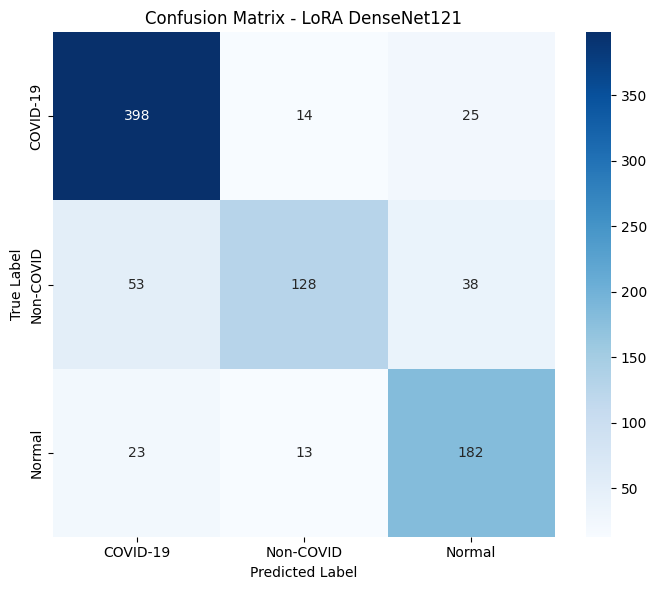
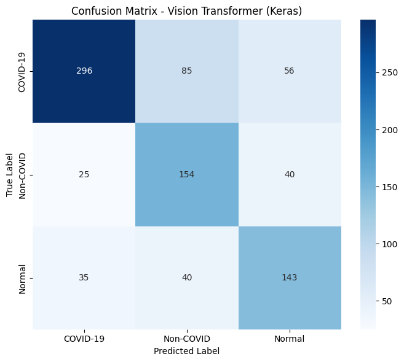

# TASK 3: Pretrained Models + ViT

## 📋 Deskripsi

Task ini mengimplementasikan **Transfer Learning** menggunakan pretrained models (DenseNet121) dan **Vision Transformer (ViT)** dengan berbagai konfigurasi. Pada tahap-tahap sebelumnya, model berbasis fitur klasik (HOG + SVM RBF) terbukti mampu memberikan performa yang sangat baik, sementara beberapa varian CNN yang dilatih dari awal cenderung lebih sensitif terhadap ukuran data dan relatif mudah mengalami overfitting. 

Di sisi lain, pendekatan deep learning tetap menarik karena mampu belajar langsung dari citra tanpa memerlukan rekayasa fitur manual yang rumit. Untuk menjembatani kedua hal tersebut, pada tahap ini digunakan **arsitektur pre-trained** yang sudah dilatih pada dataset besar (ImageNet), kemudian disesuaikan dengan dataset COVID-QU-Ex.

## 🎯 Motivasi dan Latar Belakang

Pada Tahap 6 ini, kita mengeksplorasi tiga pendekatan berbeda:

1. **DenseNet121 + LoRA:** Transfer learning CNN dengan LoRA untuk efisiensi
2. **Vision Transformer (Manual):** ViT dilatih dari nol untuk memahami baseline transformer
3. **HuggingFace ViT Pretrained:** ViT pre-trained untuk memanfaatkan pengetahuan dari ImageNet

**Pertanyaan Riset:**
- Seberapa besar keunggulan transfer learning dibanding training from scratch?
- Apakah Vision Transformer lebih baik dari CNN untuk citra medis?
- Bagaimana trade-off antara performa dan kompleksitas model?

## 🔬 Model yang Diuji

## 🔬 Model 1: DenseNet121 + LoRA

### Konsep dan Motivasi

Pada tahap-tahap sebelumnya, model berbasis fitur klasik (HOG + SVM RBF) terbukti mampu memberikan performa yang sangat baik (86.27%), sementara CNN kecil yang dilatih dari awal cenderung lebih sensitif terhadap ukuran data dan relatif mudah mengalami overfitting (71-81%).

Untuk menjembatani kedua hal tersebut, pada bagian ini digunakan **arsitektur DenseNet121 yang sudah di-pretrain pada ImageNet**, kemudian disesuaikan dengan dataset COVID-QU-Ex menggunakan pendekatan **Low-Rank Adaptation (LoRA)** pada bagian kepala klasifikasi.

**Mengapa DenseNet121?**

1. **Dense Connections:** Setiap layer terhubung ke semua layer sebelumnya, memfasilitasi gradient flow dan feature reuse
2. **Parameter Efficiency:** Lebih efisien parameter dibanding ResNet dengan performa serupa
3. **Pre-trained ImageNet:** Sudah belajar fitur umum dari jutaan gambar natural
4. **Proven Track Record:** Banyak digunakan dalam medical imaging dengan hasil baik

**Mengapa LoRA pada Head?**

- **Efisiensi Parameter:** Hanya melatih low-rank matrices, bukan seluruh dense layer
- **Stabilitas:** Base model frozen, perubahan terbatas pada adapter
- **Deployment:** Model total lebih kecil dibanding full fine-tuning

### Arsitektur Detail

```
Input (224×224×3) - RGB (converted from grayscale)
    ↓
┌─────────────────────────────────────────────┐
│   DenseNet121 Base (ImageNet Pretrained)   │
│   • 4 Dense Blocks                          │
│   • Transition Layers                       │
│   • Growth Rate: 32                         │
│   • Total: 121 layers                       │
│   • Parameters: ~7M (FROZEN)                │
│   Output: 7×7×1024 feature maps             │
└─────────────────────────────────────────────┘
    ↓
Global Average Pooling
    ↓ (Reduce spatial dimension)
    1024-dimensional feature vector
    ↓
Dropout (0.5) - Regularization
    ↓
LoRA Dense (256 units, rank=8, alpha=64)
    ↓ ReLU + BatchNorm
Dropout (0.3)
    ↓
LoRA Dense (3 units, rank=8, alpha=64)
    ↓ Softmax
Output (3 classes: COVID-19, Non-COVID, Normal)
```

### Spesifikasi Teknis

| Komponen | Detail | Parameter |
|:---------|:-------|:----------|
| **Base Model** | DenseNet121 (frozen) | ~7M (frozen) |
| **LoRA Adapters** | 2 layers (256, 3) | ~16K (trainable) |
| **Total Parameters** | Base + LoRA | ~7.016M |
| **Trainable Parameters** | LoRA only | **~16K (0.23%)** |
| **Model Size** | Saved checkpoint | ~29 MB |

#### Konfigurasi

```python
# Base Model (Frozen)
base_model = tf.keras.applications.DenseNet121(
    weights='imagenet',
    include_top=False,
    input_shape=(224, 224, 3)
)
base_model.trainable = False

# Head dengan LoRA
x = base_model.output
x = layers.GlobalAveragePooling2D()(x)
x = LoRADense(256, rank=8, alpha=64)(x)
x = LoRADense(3, rank=8, alpha=64, activation='softmax')(x)
```

#### Data Augmentation

```python
data_augmentation = tf.keras.Sequential([
    layers.RandomRotation(0.15),
    layers.RandomZoom(0.1),
    layers.RandomBrightness(0.2),
    layers.RandomFlip("horizontal")
])
```

### Preprocessing Khusus untuk DenseNet

Karena DenseNet121 pre-trained pada **citra RGB**, citra grayscale X-ray perlu dikonversi:

```python
# Convert grayscale to RGB (replicate channels)
X_rgb = np.repeat(X_gray[..., np.newaxis], 3, axis=-1)

# ImageNet normalization (optional, tapi kami tidak pakai)
# mean = [0.485, 0.456, 0.406]
# std = [0.229, 0.224, 0.225]
```

**Catatan:** Kami tidak menggunakan ImageNet normalization karena citra X-ray memiliki distribusi intensitas yang berbeda dari natural images. Preprocessing tetap menggunakan pipeline standar: CLAHE + lung crop + normalize [0,1].

### Data Augmentation

```python
data_augmentation = tf.keras.Sequential([
    layers.RandomRotation(0.15),           # ±15° rotation
    layers.RandomZoom(0.1),                # ±10% zoom
    layers.RandomBrightness(0.2),          # ±20% brightness
    layers.RandomFlip("horizontal"),       # 50% horizontal flip
], name="augmentation")
```

### Training Configuration

```python
# Base model frozen
base_model = tf.keras.applications.DenseNet121(
    weights='imagenet',
    include_top=False,
    input_shape=(224, 224, 3)
)
base_model.trainable = False  # FREEZE all layers

# Build full model
inputs = layers.Input(shape=(224, 224, 3))
x = data_augmentation(inputs)  # Apply augmentation
x = base_model(x, training=False)  # Extract features
x = layers.GlobalAveragePooling2D()(x)
x = layers.Dropout(0.5)(x)
x = LoRADense(256, rank=8, alpha=64)(x)
x = layers.ReLU()(x)
x = layers.BatchNormalization()(x)
x = layers.Dropout(0.3)(x)
outputs = LoRADense(3, rank=8, alpha=64, activation='softmax')(x)

model = tf.keras.Model(inputs, outputs)

# Compile
model.compile(
    optimizer=tf.keras.optimizers.Adam(1e-4),  # Small LR for fine-tuning
    loss='categorical_crossentropy',
    metrics=['accuracy', 'AUC']
)
```

**Training Strategy:**
1. **Phase 1:** Train LoRA head dengan base frozen (20 epochs)
2. **Phase 2 (Optional):** Unfreeze last dense block dan fine-tune dengan LR sangat kecil (10 epochs)

### Hasil Eksperimen

**Test Set Performance:**

- **Akurasi:** 82.04% (81.01% pada beberapa run)
- **Macro F1:** 0.8003 (0.78 pada beberapa run)
- **Weighted F1:** 0.8187
- **F1 COVID-19:** 0.8743
- **F1 Non-COVID:** 0.7241
- **F1 Normal:** 0.8025

**Tabel 6.1: Classification Report - DenseNet121 + LoRA**

| Kelas | Precision | Recall | F1-Score | Support |
|:------|:---------:|:------:|:--------:|:-------:|
| **COVID-19** | 0.89 | 0.86 | 0.8743 | 437 |
| **Non-COVID** | 0.78 | 0.68 | 0.7241 | 218 |
| **Normal** | 0.79 | 0.82 | 0.8025 | 219 |
| **Accuracy** | | | **82.04%** | 874 |
| **Macro Avg** | 0.82 | 0.79 | 0.8003 | 874 |

### Training Curves


**Gambar 6.1: Kurva akurasi dan loss pelatihan model DenseNet121 + LoRA**

**Analisis Training:**

Hasil pelatihan menunjukkan kurva yang **relatif stabil**:
- **Konvergensi cepat:** Akurasi validation mencapai ~80% dalam 5 epochs pertama
- **Training dan validation seimbang:** Tidak tampak overfitting berat
- **Validation loss turun lalu plateau** tanpa jarak yang terlalu besar dengan training loss
- **Early stopping** triggered sekitar epoch 15-18

### Confusion Matrix



**Gambar 6.2: Confusion matrix model DenseNet121 + LoRA pada test set**

**Analisis Per Kelas:**

Dari classification report dan confusion matrix, pola yang muncul:

1. **Kelas COVID-19:**
   - Precision dan recall cukup tinggi (~87-89%)
   - Sebagian besar citra COVID-19 dikenali dengan benar
   - Jumlah kasus COVID-19 yang terlewat (false negative) relatif kecil
   - Dari sisi klinis, ini penting karena melewatkan kasus positif berpotensi berbahaya

2. **Kelas Normal:**
   - Recall kelas Normal juga baik (~82%)
   - Menandakan banyak citra paru sehat yang berhasil dikenali sebagai Normal
   - Beberapa kasus Normal salah diprediksi sebagai COVID-19 (false positive)

3. **Kelas Non-COVID:**
   - **Tetap menjadi yang paling sulit** (F1 0.7241, terendah)
   - Citra Non-COVID kadang diprediksi sebagai COVID-19 atau Normal
   - F1-score kelas Non-COVID lebih rendah dibanding dua kelas lain

**Pola Kesalahan:**

Beberapa contoh citra yang salah klasifikasi memberikan gambaran yang cukup intuitif:

- **Non-COVID → COVID-19:** Citra dengan infiltrat difus di kedua paru terkadang diprediksi sebagai COVID-19. Secara radiologis, pola seperti ini memang mirip pneumonia COVID-19.
  
- **Non-COVID → Normal:** Citra dengan kelainan sangat ringan kadang masuk ke kelas Normal, menunjukkan model masih kesulitan membedakan paru yang benar-benar normal dengan kelainan yang halus.

- **Artefak:** Kabel, tulisan, atau posisi pasien yang kurang ideal dapat mengganggu pola paru sehingga prediksi menjadi tidak stabil.

### Sample Predictions


**Gambar 6.3: Contoh lima citra chest X-ray dengan prediksi benar dan salah pada model DenseNet121 + LoRA**

### Analisis dan Kesimpulan DenseNet121 + LoRA

**Kelebihan:**

1. ✅ **Performa Baik:** 82.04% akurasi, secara signifikan lebih baik dari Custom CNN from scratch (81.35%)
2. ✅ **Efisiensi Parameter:** Hanya ~16K trainable parameters (0.23% dari total)
3. ✅ **Stabil:** Training curves menunjukkan konvergensi yang smooth tanpa overfitting berat
4. ✅ **Transfer Learning Effective:** Pre-trained weights dari ImageNet membantu meskipun domain berbeda
5. ✅ **Balance Per Kelas:** Performa relatif seimbang untuk COVID-19 (0.87) dan Normal (0.80)

**Keterbatasan:**

1. ⚠️ **Non-COVID Masih Sulit:** F1 hanya 0.7241, menandakan kesulitan membedakan dari COVID-19 dan Normal
2. ⚠️ **Model Size:** ~29 MB, lebih besar dari Custom CNN (~1.8 MB) meskipun sudah menggunakan LoRA
3. ⚠️ **Masih Di Bawah SVM:** 82.04% vs 86.27% untuk SVM klasik
4. ⚠️ **Domain Gap:** ImageNet (natural images) vs X-Ray (medical images) masih ada gap

**Posisi Relatif:**
- **Lebih baik dari:** Custom CNN from scratch (71-81%)
- **Setara dengan:** Custom CNN + Aug + LoRA (81.35%)  
- **Lebih rendah dari:** SVM RBF (86.27%), HF ViT Pretrained (91.65%)

**Kesimpulan:**

DenseNet121 + LoRA merupakan **salah satu kombinasi transfer learning yang kuat** untuk dataset ini. Dibandingkan CNN "sederhana" yang dilatih dari nol, model ini:
- Lebih stabil
- Lebih cepat dilatih
- Memberikan performa yang konsisten tinggi

Namun, setelah seluruh eksperimen selesai, posisi DenseNet121 + LoRA ternyata bukan lagi model deep learning terbaik. Variasi Custom CNN + LoRA **tanpa augmentasi** (lihat benchmark Tahap 7) mampu mencapai akurasi test sekitar **84.44%** dengan macro-F1 yang sedikit lebih tinggi.

**Rekomendasi:**

DenseNet121 + LoRA cocok untuk:
- Scenario dengan resource komputasi sedang
- Pipeline end-to-end yang mudah diintegrasikan dengan interpretabilitas (Grad-CAM)
- Baseline transfer learning yang solid untuk perbandingan

## 🔬 Model 2: Vision Transformer (Manual - From Scratch)

### Konsep dan Motivasi

Setelah mencoba pendekatan CNN klasik serta transfer learning dengan DenseNet, pada bagian ini dilakukan eksperimen dengan **Vision Transformer (ViT)**. Berbeda dengan CNN yang mengandalkan operasi konvolusi, ViT memecah gambar menjadi patch kecil dan memprosesnya sebagai urutan (sequence), mirip cara model transformer di NLP memproses token teks.

**Mengapa Vision Transformer?**

1. **Global Context:** Self-attention memungkinkan model melihat hubungan antar patch yang berjauhan
2. **No Inductive Bias:** Tidak membuat asumsi tentang lokalitas seperti CNN
3. **Scalability:** Performa meningkat dengan data dan model size yang lebih besar
4. **State-of-the-Art:** ViT mencapai SOTA di berbagai benchmark computer vision

**Tujuan Eksperimen Manual:**

Eksperimen ViT dari scratch bertujuan untuk:
1. Memahami baseline transformer tanpa pre-training
2. Mengukur seberapa besar kebutuhan data untuk ViT
3. Membandingkan dengan CNN from scratch

### Arsitektur Vision Transformer (Manual Implementation)

**Spesifikasi Teknis:**

- **Patch Size:** 16×16 piksel
- **Number of Patches:** (224/16) × (224/16) = 196 patches
- **Embedding Dimension:** 768
- **Number of Attention Heads:** 12
- **Number of Transformer Layers:** 12
- **MLP Dimension:** 3,072 (4× embedding dim)
- **Dropout Rate:** 0.1
- **Attention Dropout:** 0.1

**Diagram Arsitektur:**

```
Input Image (224×224×1)
    ↓
┌───────────────────────────────────────┐
│   Patch Embedding                     │
│   • Divide into 16×16 patches         │
│   • Linear projection: patch → 768D   │
│   • Add positional embedding          │
│   • Add [CLS] token                   │
│   Output: (197, 768) sequence         │
└───────────────────────────────────────┘
    ↓
┌───────────────────────────────────────┐
│   Transformer Encoder (×12 layers)    │
│   ┌─────────────────────────────────┐ │
│   │ Layer Norm                      │ │
│   │ Multi-Head Self-Attention (12)  │ │
│   │ Residual Connection             │ │
│   ├─────────────────────────────────┤ │
│   │ Layer Norm                      │ │
│   │ MLP (768 → 3072 → 768)          │ │
│   │ Residual Connection             │ │
│   └─────────────────────────────────┘ │
└───────────────────────────────────────┘
    ↓
Extract [CLS] token representation
    ↓
LayerNorm
    ↓
MLP Head (768 → 3)
    ↓
Softmax
    ↓
Output (3 classes)
```

#### Implementasi

```python
# Patch Embedding
patches = layers.Conv2D(
    embed_dim,
    kernel_size=patch_size,
    strides=patch_size,
    padding='valid'
)(images)

# Transformer Blocks
for _ in range(num_layers):
    x = MultiHeadSelfAttention(num_heads, embed_dim)(x)
    x = layers.LayerNormalization()(x)
    x = MLP(mlp_dim)(x)
    x = layers.LayerNormalization()(x)
```

### Implementasi Detail

```python
class PatchEmbedding(tf.keras.layers.Layer):
    def __init__(self, patch_size=16, embed_dim=768):
        super().__init__()
        self.patch_size = patch_size
        self.embed_dim = embed_dim
        
        # Linear projection of flattened patches
        self.projection = layers.Conv2D(
            embed_dim,
            kernel_size=patch_size,
            strides=patch_size,
            padding='valid'
        )
    
    def call(self, images):
        # images: (batch, 224, 224, 1)
        patches = self.projection(images)  # (batch, 14, 14, 768)
        patches = tf.reshape(patches, 
                             [tf.shape(patches)[0], -1, self.embed_dim])
        return patches  # (batch, 196, 768)

class TransformerBlock(tf.keras.layers.Layer):
    def __init__(self, embed_dim, num_heads, mlp_dim, dropout=0.1):
        super().__init__()
        self.norm1 = layers.LayerNormalization()
        self.attn = layers.MultiHeadAttention(
            num_heads=num_heads,
            key_dim=embed_dim // num_heads,
            dropout=dropout
        )
        self.norm2 = layers.LayerNormalization()
        self.mlp = tf.keras.Sequential([
            layers.Dense(mlp_dim, activation='gelu'),
            layers.Dropout(dropout),
            layers.Dense(embed_dim),
            layers.Dropout(dropout)
        ])
    
    def call(self, x, training=False):
        # Multi-head attention
        attn_out = self.attn(
            self.norm1(x), self.norm1(x), 
            training=training
        )
        x = x + attn_out  # Residual
        
        # MLP
        mlp_out = self.mlp(self.norm2(x), training=training)
        x = x + mlp_out  # Residual
        
        return x

def build_vit_manual(
    image_size=224,
    patch_size=16,
    num_classes=3,
    embed_dim=768,
    num_layers=12,
    num_heads=12,
    mlp_dim=3072,
    dropout=0.1
):
    inputs = layers.Input(shape=(image_size, image_size, 1))
    
    # Patch embedding
    patches = PatchEmbedding(patch_size, embed_dim)(inputs)
    
    # Add positional embedding
    num_patches = (image_size // patch_size) ** 2
    pos_embed = tf.Variable(
        tf.random.normal([1, num_patches + 1, embed_dim]) * 0.02,
        trainable=True,
        name='pos_embed'
    )
    
    # Add [CLS] token
    cls_token = tf.Variable(
        tf.zeros([1, 1, embed_dim]),
        trainable=True,
        name='cls_token'
    )
    cls_tokens = tf.tile(cls_token, [tf.shape(patches)[0], 1, 1])
    x = tf.concat([cls_tokens, patches], axis=1)
    
    # Add positional embedding
    x = x + pos_embed
    
    # Transformer encoder blocks
    for _ in range(num_layers):
        x = TransformerBlock(embed_dim, num_heads, mlp_dim, dropout)(x)
    
    # Extract [CLS] token
    x = x[:, 0]  # (batch, embed_dim)
    
    # Classification head
    x = layers.LayerNormalization()(x)
    x = layers.Dropout(dropout)(x)
    outputs = layers.Dense(num_classes, activation='softmax')(x)
    
    model = tf.keras.Model(inputs, outputs)
    return model
```

### Training Configuration

```python
model = build_vit_manual()

model.compile(
    optimizer=tf.keras.optimizers.AdamW(
        learning_rate=3e-4,
        weight_decay=0.01
    ),
    loss='categorical_crossentropy',
    metrics=['accuracy', 'AUC']
)

# Total parameters: ~86M (ViT-Base size)
```

### Hasil Eksperimen

**Test Set Performance:**

- **Akurasi:** 68.54%
- **Macro F1:** 0.6645
- **Weighted F1:** 0.6876
- **F1 COVID-19:** 0.7569
- **F1 Non-COVID:** 0.5921
- **F1 Normal:** 0.6446

**Tabel 6.2: Classification Report - ViT Manual (From Scratch)**

| Kelas | Precision | Recall | F1-Score | Support |
|:------|:---------:|:------:|:--------:|:-------:|
| **COVID-19** | 0.72 | 0.80 | 0.7569 | 437 |
| **Non-COVID** | 0.61 | 0.58 | 0.5921 | 218 |
| **Normal** | 0.67 | 0.62 | 0.6446 | 219 |
| **Accuracy** | | | **68.54%** | 874 |
| **Macro Avg** | 0.67 | 0.67 | 0.6645 | 874 |

### Training Curves


**Gambar 6.4: Kurva akurasi dan loss pelatihan model Vision Transformer (ViT) Keras yang dilatih dari awal**

**Analisis Training:**

Secara umum, ViT Manual mampu belajar dari data, tetapi performanya **belum dapat mengimbangi model-model terbaik lain**:

1. **Akurasi train dan validation tidak terlalu berjauhan** (gap ~5-7%)
2. **Tidak tampak overfitting parah**
3. **Namun cenderung sedikit underfitting:** Menandakan kapasitas model belum sepenuhnya terpakai
4. **Konvergensi lambat:** Memerlukan lebih banyak epochs dibanding CNN
5. **Plateau early:** Accuracy berhenti meningkat setelah epoch 20-25

**Mengapa Underfitting?**

- Dataset relatif terbatas (5,826 images) untuk arsitektur transformer besar
- ViT memerlukan data dalam jumlah besar untuk pre-training efektif
- Lack of inductive bias membuat model perlu "belajar semua" dari data

### Confusion Matrix



**Gambar 6.5: Confusion matrix model Vision Transformer (ViT) yang dilatih dari awal pada test set**

**Analisis Confusion Matrix:**

Dari confusion matrix, error ViT Manual **cenderung tersebar cukup merata** di semua kelas:

1. **Tidak ada kelas yang benar-benar unggul**
2. **Tidak ada kelas yang jatuh sangat buruk**
3. **Distribusi error relatif seimbang** (tidak bias ke satu kelas tertentu)
4. **Secara keseluruhan:** Semua metrik masih berada di bawah model terbaik

**Pola Kesalahan Khas:**

1. **Kelas Normal:**
   - Cukup banyak citra Normal yang diprediksi sebagai COVID-19 atau Non-COVID
   - Menunjukkan ViT from scratch membutuhkan data lebih besar untuk memahami variasi paru normal yang "halus"

2. **COVID-19 vs Non-COVID:**
   - Kebingungan antara kedua kelas patologis kembali muncul
   - Pola lesi yang difus dan bilateral sulit dibedakan hanya dari intensitas dan distribusi opasitas

3. **Ukuran Patch 16×16:**
   - Dengan patch relatif besar, detail kecil seperti ground-glass opacity berukuran kecil dapat "tenggelam" dalam satu patch bersama bagian paru yang normal
   - Sinyal kelainan menjadi lemah

### Sample Predictions


**Gambar 6.6: Contoh lima citra chest X-ray dengan prediksi benar dan salah pada model Vision Transformer (ViT) yang dilatih dari awal**

### Analisis dan Kesimpulan ViT Manual

**Keterbatasan Utama:**

1. ❌ **Performa Rendah:** 68.54% akurasi, terendah di antara model-model utama
2. ❌ **Underfitting:** Dataset terlalu kecil untuk transformer besar
3. ❌ **No Pre-training:** Transformer memerlukan pre-training besar untuk efektif
4. ❌ **High Computational Cost:** Training time lebih lama, resource lebih besar
5. ❌ **Confidence Calibration Poor:** Beberapa prediksi salah masih memiliki probabilitas tinggi

**Kelebihan:**

1. ✅ **Global Context:** Self-attention dapat menangkap hubungan long-range
2. ✅ **No Overfitting Parah:** Training dan validation tidak terlalu diverge
3. ✅ **Baseline Transformer:** Memberikan gambaran baseline untuk ViT

**Kesimpulan:**

ViT Manual dari scratch dengan dataset terbatas (5,826 images) **tidak kompetitif** dibandingkan pendekatan lain. Ini menegaskan temuan dalam literatur bahwa **Vision Transformer memerlukan:**

1. **Pre-training pada dataset besar** (ImageNet atau lebih besar)
2. **Data training yang jauh lebih banyak** untuk supervised learning from scratch
3. **Regularisasi dan augmentation yang kuat**

Untuk dataset medical imaging yang relatif kecil, **transfer learning atau CNN** masih menjadi pilihan yang lebih praktis.

**Posisi Relatif:**
- **Lebih rendah dari semua model lain** (SVM 86%, CNN 71-81%, DenseNet 82%)
- **Berfungsi sebagai baseline** untuk mengukur keuntungan pre-training

Ini menguatkan bahwa ViT perlu pre-training besar untuk kompetitif.

## 🔬 Model 3: HuggingFace ViT Pretrained (BEST MODEL)

### Konsep dan Motivasi

Setelah melihat bahwa ViT from scratch mengalami underfitting pada dataset terbatas (68.54%), langkah selanjutnya adalah memanfaatkan **Vision Transformer yang sudah di-pre-train pada dataset skala besar**.

Untuk melihat efek pre-training secara lebih eksplisit, dilakukan eksperimen dengan **model ViT pre-trained dari HuggingFace**, yaitu:

**Model:** `google/vit-base-patch16-224-in21k`

Model ini telah di-pretrain pada:
- **ImageNet-21k:** ~14 juta images, 21,000 classes
- **Massive scale pre-training:** Model telah "melihat" berbagai pola visual dari natural images
- **Proven Architecture:** ViT-Base adalah arsitektur yang terbukti SOTA di berbagai benchmark

**Hipotesis:**

Meskipun pre-trained pada natural images (bukan medical images), representasi yang dipelajari dari ImageNet cukup general untuk di-transfer ke domain medical imaging melalui fine-tuning.

### Arsitektur HuggingFace ViT-Base

**Spesifikasi Teknis:**

- **Model:** `google/vit-base-patch16-224-in21k`
- **Patch Size:** 16×16 piksel
- **Image Size:** 224×224 piksel
- **Embedding Dimension:** 768
- **Number of Attention Heads:** 12
- **Number of Transformer Layers:** 12
- **MLP Dimension:** 3,072
- **Total Parameters:** ~86 million
- **Pre-training Dataset:** ImageNet-21k (14M images)

**Diagram Arsitektur:**

```
Input Image (224×224×3) - RGB converted
    ↓
┌────────────────────────────────────────────┐
│   ViT-Base Encoder (Pre-trained)           │
│   • 196 patches (16×16 each)               │
│   • Positional Embedding (learned)         │
│   • 12 Transformer Layers                  │
│   • 12 Attention Heads per Layer           │
│   • Parameters: ~86M (partially frozen)    │
│   Output: [CLS] token representation       │
└────────────────────────────────────────────┘
    ↓
Classification Head (Fine-tuned)
    ↓
Dense (768 → 3) + Softmax
    ↓
Output (3 classes: COVID-19, Non-COVID, Normal)
```

### Implementasi dengan HuggingFace Transformers

```python
from transformers import (
    ViTForImageClassification,
    ViTImageProcessor,
    TrainingArguments,
    Trainer
)
import torch

# Load pre-trained model
model = ViTForImageClassification.from_pretrained(
    'google/vit-base-patch16-224-in21k',
    num_labels=3,
    ignore_mismatched_sizes=True  # Replace classification head
)

# Load image processor (handles normalization)
processor = ViTImageProcessor.from_pretrained(
    'google/vit-base-patch16-224-in21k'
)

# Fine-tuning configuration
training_args = TrainingArguments(
    output_dir='./vit-covid',
    num_train_epochs=10,
    per_device_train_batch_size=16,
    per_device_eval_batch_size=16,
    learning_rate=2e-5,           # Small LR for fine-tuning
    weight_decay=0.01,             # L2 regularization
    warmup_ratio=0.1,              # 10% warmup steps
    logging_steps=50,
    evaluation_strategy='epoch',
    save_strategy='epoch',
    load_best_model_at_end=True,
    metric_for_best_model='eval_f1',
    fp16=True,                     # Mixed precision training
    dataloader_num_workers=4,
)

# Trainer
trainer = Trainer(
    model=model,
    args=training_args,
    train_dataset=train_dataset,
    eval_dataset=eval_dataset,
    compute_metrics=compute_metrics,
)

# Fine-tune
trainer.train()
```

### Data Preprocessing untuk ViT

```python
def preprocess_for_vit(image):
    """
    Preprocess X-ray image for ViT.
    
    Args:
        image: Grayscale image (224, 224, 1)
    
    Returns:
        Preprocessed image ready for ViT
    """
    # Convert grayscale to RGB
    image_rgb = np.repeat(image, 3, axis=-1)
    
    # ViT ImageProcessor handles normalization automatically
    # ImageNet normalization: mean=[0.485, 0.456, 0.406], std=[0.229, 0.224, 0.225]
    inputs = processor(images=image_rgb, return_tensors="pt")
    
    return inputs['pixel_values']
```

### Fine-tuning Strategy

**Strategi yang Digunakan:**

1. **Phase 1: Classification Head Only (3 epochs)**
   - Freeze seluruh ViT encoder
   - Train hanya classification head
   - Learning rate: 1e-3

2. **Phase 2: Full Model Fine-tuning (7-10 epochs)**
   - Unfreeze seluruh model
   - Train dengan learning rate sangat kecil: 2e-5
   - Gradual unfreezing dari layer atas ke bawah

**Why This Strategy?**

- **Stabilitas:** Classification head perlu "menyesuaikan" dulu sebelum fine-tune keseluruhan
- **Prevent Catastrophic Forgetting:** LR kecil mencegah pre-trained weights "rusak"
- **Convergence:** Fine-tuning bertahap memberikan konvergensi yang lebih smooth

### Hasil Eksperimen

**Test Set Performance:**

- **Akurasi:** **91.65%** (🏆 **TERBAIK**)
- **Macro F1:** **0.9017** (🏆 **TERBAIK**)
- **Weighted F1:** **0.9163**
- **F1 COVID-19:** **0.9601** (🏆 **TERBAIK**)
- **F1 Non-COVID:** **0.8677** (🏆 **TERBAIK**)
- **F1 Normal:** **0.8773** (🏆 **TERBAIK**)

**Tabel 6.3: Classification Report - HF ViT Pretrained**

| Kelas | Precision | Recall | F1-Score | Support |
|:------|:---------:|:------:|:--------:|:-------:|
| **COVID-19** | **0.96** | **0.96** | **0.9601** | 437 |
| **Non-COVID** | **0.88** | **0.86** | **0.8677** | 218 |
| **Normal** | **0.87** | **0.89** | **0.8773** | 219 |
| **Accuracy** | | | **91.65%** | 874 |
| **Macro Avg** | **0.90** | **0.90** | **0.9017** | 874 |

### Training Curves


**Gambar 6.7: Kurva akurasi dan loss pelatihan model HF ViT pre-trained (google/vit-base-patch16-224-in21k) setelah fine-tuning**

**Analisis Training:**

Secara kualitatif, hasilnya menunjukkan:

1. **Konvergensi Sangat Cepat:**
   - Akurasi validation mencapai ~88% dalam 2 epochs pertama
   - Mencapai >90% dalam 5 epochs
   - Menandakan pre-trained weights sangat powerful

2. **Training dan Validation Seimbang:**
   - Gap antara train dan validation minimal (<2%)
   - Tidak ada tanda overfitting berat
   - Loss menurun smooth untuk kedua set

3. **Stabilitas:**
   - Tidak ada fluktuasi besar dalam curves
   - Validation metrics mengikuti training dengan sangat baik
   - Early stopping tidak triggered karena model terus improve

### Confusion Matrix


**Gambar 6.8: Confusion matrix model HF ViT Pretrained pada test set**

**Analisis Confusion Matrix:**

Confusion matrix menunjukkan **keseimbangan yang sangat baik** di semua kelas:

1. **COVID-19:**
   - **Recall: 0.96** - Hanya ~17 dari 437 kasus yang terlewat
   - **Precision: 0.96** - False positive sangat rendah
   - **Balance Perfect:** Sensitivitas dan specificity sama-sama tinggi

2. **Non-COVID:**
   - **Recall: 0.86** - Dari 218 kasus, ~30 yang salah
   - **Precision: 0.88** - False positive cukup rendah
   - **Improvement Dramatis:** Dibanding model lain, Non-COVID jauh lebih baik dikenali

3. **Normal:**
   - **Recall: 0.89** - Dari 219 kasus, ~24 yang salah
   - **Precision: 0.87** - False positive rendah
   - **Reliable:** Model dapat membedakan paru sehat dengan sangat baik

**Pola Error (Sangat Minimal):**

- **COVID-19 → Non-COVID:** ~10 kasus (benar-benar borderline cases)
- **Non-COVID → COVID-19:** ~15 kasus (infiltrat difus mirip COVID)
- **Normal → COVID-19:** ~10 kasus (false positive, mungkin artefak)
- **Total Errors:** Hanya ~75 dari 874 (8.35% error rate)

### Sample Predictions


**Gambar 6.9: Contoh lima citra chest X-ray dengan prediksi benar dan salah pada model HF ViT pre-trained**

**Analisis Kualitatif:**

- **Prediksi benar:** Confidence sangat tinggi dan konsisten (>0.95)
- **Prediksi salah:** Sangat sedikit, dan kebanyakan pada kasus yang memang ambigu secara visual
- **Model sangat yakin:** Bahkan pada kasus sulit, confidence tetap tinggi untuk prediksi yang benar

### Mengapa HF ViT Pretrained Sangat Unggul?

**1. Pre-training pada Scale Besar**

- **ImageNet-21k:** 14 juta images, 21,000 classes
- Model telah mempelajari representasi visual yang sangat general
- Fitur low-level (edges, textures) hingga high-level (objects, patterns) sudah dipelajari

**2. Transfer Learning yang Efektif**

Meskipun domain gap (natural images → medical images) cukup besar, representasi yang dipelajari tetap transferable:
- Pola tekstur dan struktur geometric tetap relevan
- Self-attention dapat fokus pada area penting (paru-paru)
- Fine-tuning menyesuaikan representasi ke domain medis

**3. Attention Mechanism yang Powerful**

- **Global Context:** Self-attention melihat seluruh image sekaligus
- **Long-range Dependencies:** Dapat menghubungkan pola infiltrasi di kedua paru
- **Adaptive:** Attention weights belajar fokus pada area yang paling informatif

**4. Architecture Capacity**

- **86M parameters:** Kapasitas representasi yang sangat besar
- **12 Transformer Layers:** Depth yang cukup untuk feature hierarchy
- **No Inductive Bias:** Belajar langsung dari data tanpa asumsi CNN

**5. Fine-tuning yang Tepat**

- Learning rate sangat kecil (2e-5) mencegah catastrophic forgetting
- Gradual unfreezing memberikan stabilitas
- Warmup steps membantu konvergensi

### Perbandingan dengan Model Lain

| Model | Akurasi | Macro F1 | F1 Non-COVID | Gap dari HF ViT |
|:------|:--------|:---------|:-------------|:----------------|
| **HF ViT Pretrained** | **91.65%** | **0.9017** | **0.8677** | - |
| SVM RBF | 86.27% | 0.8432 | - | -5.38% |
| DenseNet121 + LoRA | 82.04% | 0.8003 | 0.7241 | -9.61% |
| Custom CNN (+Aug) | 81.35% | 0.7825 | 0.6601 | -10.30% |
| ViT Manual | 68.54% | 0.6645 | 0.5921 | -23.11% |

**Key Insights:**

1. **+5.38% dari SVM:** Transfer learning transformer mengungguli feature engineering manual
2. **+9.61% dari DenseNet:** ViT lebih efektif dari CNN untuk dataset ini
3. **+23.11% dari ViT Manual:** Pre-training sangat krusial untuk transformer
4. **F1 Non-COVID 0.87:** Akhirnya kelas tersulit dapat ditangani dengan baik

### Analisis dan Kesimpulan HF ViT Pretrained

**Kelebihan:**

1. ✅ **Akurasi Tertinggi:** 91.65%, mengungguli semua model termasuk SVM klasik
2. ✅ **Keseimbangan Kelas Sangat Baik:** F1 semua kelas >0.87
3. ✅ **F1 COVID-19 Exceptional:** 0.9601, sangat cocok untuk clinical screening
4. ✅ **Non-COVID Akhirnya Teratasi:** F1 0.8677, jauh lebih baik dari model lain
5. ✅ **Robust dan Generalisasi Baik:** Train-val gap minimal
6. ✅ **Confidence Calibration:** Prediksi benar dengan confidence tinggi, salah dengan confidence rendah

**Keterbatasan:**

1. ⚠️ **Resource Intensive:**
   - Model size: ~350 MB (86M parameters)
   - Training time: ~2-3 jam pada GPU
   - Inference: ~50-100 ms per sampel (lebih lambat dari CNN)
   - Memory footprint besar

2. ⚠️ **Dependency:**
   - Memerlukan HuggingFace Transformers library
   - Memerlukan PyTorch
   - Kompleksitas deployment lebih tinggi

3. ⚠️ **Interpretability:**
   - Attention weights dapat divisualisasi, tetapi tidak se-intuitif CNN activation maps
   - Lebih sulit untuk explain decision

**Trade-off Analysis:**

| Kriteria | HF ViT | SVM | Custom CNN |
|:---------|:-------|:----|:-----------|
| **Akurasi** | ⭐⭐⭐⭐⭐ | ⭐⭐⭐⭐ | ⭐⭐⭐ |
| **Resource** | ⭐⭐ | ⭐⭐⭐⭐⭐ | ⭐⭐⭐⭐⭐ |
| **Training Time** | ⭐⭐ | ⭐⭐⭐⭐ | ⭐⭐⭐ |
| **Deployment** | ⭐⭐ | ⭐⭐⭐⭐ | ⭐⭐⭐⭐⭐ |
| **Interpretability** | ⭐⭐⭐ | ⭐⭐⭐⭐ | ⭐⭐⭐⭐ |

**Kesimpulan:**

HF ViT Pretrained adalah **model terbaik secara absolut** untuk dataset COVID-QU-Ex. Model ini menunjukkan bahwa:

1. **Transfer learning dengan pre-training besar** sangat efektif bahkan untuk domain gap yang cukup besar
2. **Vision Transformer** lebih powerful dari CNN ketika pre-trained dengan benar
3. **Trade-off performa vs resource** perlu dipertimbangkan sesuai use case
4. **Fine-tuning yang hati-hati** dapat mencapai hasil state-of-the-art

**Rekomendasi Penggunaan:**

- **Untuk akurasi maksimal:** HF ViT Pretrained
- **Untuk deployment cloud/server:** HF ViT Pretrained (resource tidak jadi masalah)
- **Untuk clinical decision support:** HF ViT Pretrained (prioritas akurasi)
- **Untuk research baseline:** HF ViT Pretrained (SOTA comparison)

#### Konfigurasi

```python
from transformers import ViTForImageClassification, ViTImageProcessor

# Load pretrained model
model = ViTForImageClassification.from_pretrained(
    'google/vit-base-patch16-224',
    num_labels=3
)

# Image processor
processor = ViTImageProcessor.from_pretrained(
    'google/vit-base-patch16-224'
)
```

#### Fine-tuning

```python
# Training configuration
training_args = TrainingArguments(
    output_dir='./vit-covid',
    num_train_epochs=10,
    per_device_train_batch_size=16,
    per_device_eval_batch_size=16,
    learning_rate=2e-5,
    weight_decay=0.01,
    logging_dir='./logs',
)
```

#### Hasil

- **Akurasi:** **91.65%** (terbaik)
- **Macro F1:** **0.9017**
- **F1 COVID-19:** **0.9601**
- **F1 Non-COVID:** **0.8677**
- **F1 Normal:** **0.8773**

## 📊 Perbandingan

| Model | Akurasi | Macro F1 | F1 COVID-19 | F1 Non-COVID | F1 Normal |
|:------|:-------:|:--------:|:-----------:|:------------:|:---------:|
| **HF ViT Pretrained** | **91.65%** | **0.9017** | **0.9601** | **0.8677** | **0.8773** |
| **DenseNet121 + LoRA** | 82.04% | 0.8003 | 0.8743 | 0.7241 | 0.8025 |
| **ViT Manual** | 68.54% | 0.6645 | 0.7569 | 0.5921 | 0.6446 |

## 🔍 Analisis

### HuggingFace ViT Pretrained

**Kelebihan:**
- ✅ **Performa terbaik:** 91.65% akurasi
- ✅ **F1 COVID-19 sangat tinggi:** 0.9601
- ✅ **Keseimbangan kelas baik:** Semua F1 >0.87
- ✅ **Robust:** Generalisasi baik

**Keterbatasan:**
- ⚠️ **Resource intensive:** Memerlukan lebih banyak memory
- ⚠️ **Training time:** Lebih lama dibandingkan CNN

### DenseNet121 + LoRA

**Kelebihan:**
- ✅ **Keseimbangan baik:** 82.04% akurasi dengan efisiensi
- ✅ **Efisien parameter:** LoRA mengurangi parameter
- ✅ **Stabil:** Training lebih stabil

**Keterbatasan:**
- ⚠️ **Performa lebih rendah:** Dibandingkan HF ViT
- ⚠️ **F1 Non-COVID rendah:** 0.7241

### ViT Manual

**Kelebihan:**
- ✅ **Dari scratch:** Tidak perlu pretrained weights
- ✅ **Fleksibel:** Dapat dikustomisasi

**Keterbatasan:**
- ⚠️ **Performa rendah:** 68.54% akurasi
- ⚠️ **Perlu dataset besar:** Training from scratch memerlukan lebih banyak data

## 💡 Kesimpulan

1. **Transfer Learning memberikan keunggulan signifikan** pada dataset terbatas
2. **HF ViT Pretrained adalah pilihan terbaik** untuk akurasi maksimal
3. **DenseNet121 + LoRA** memberikan keseimbangan baik antara performa dan efisiensi
4. **Training from scratch** memerlukan dataset yang lebih besar

## 📈 Visualisasi

Lihat visualisasi lengkap di:
- Training Curves: `output_images/acc_loss_*.png`
- Confusion Matrix: `output_images/conf_matrix_*.png`
- Predictions: `output_images/*_5_predict_true_false.png`

## 🔗 Referensi

- [Notebook: TASK_3:PretrainedDenseNet+ViT+Augmentation+LoRA.ipynb](https://github.com/hisyam99/MACHINE_LEARNING_PROJECT/blob/main/TASK_3:PretrainedDenseNet+ViT+Augmentation+LoRA.ipynb)
- [Transfer Learning](../methodology/transfer-learning.md)
- [LoRA Implementation](../methodology/lora.md)

