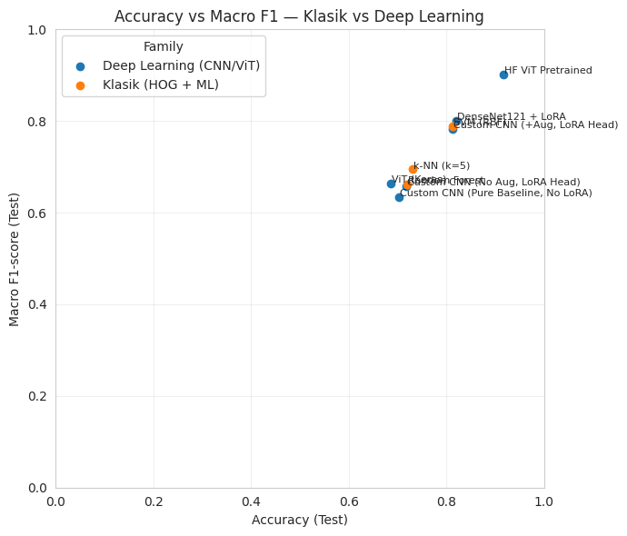
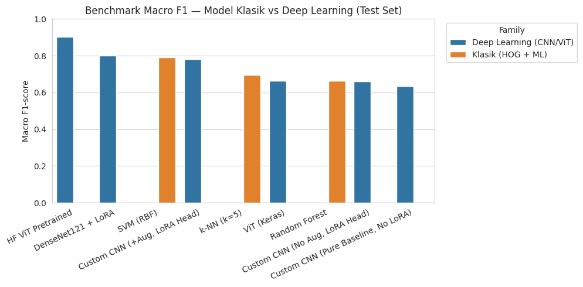
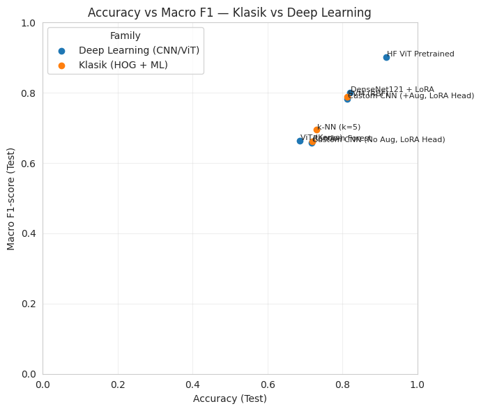
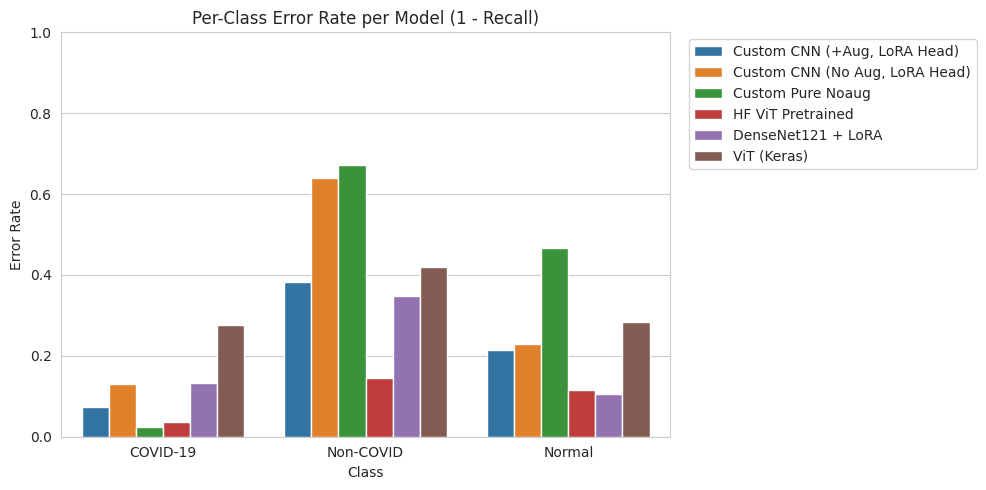
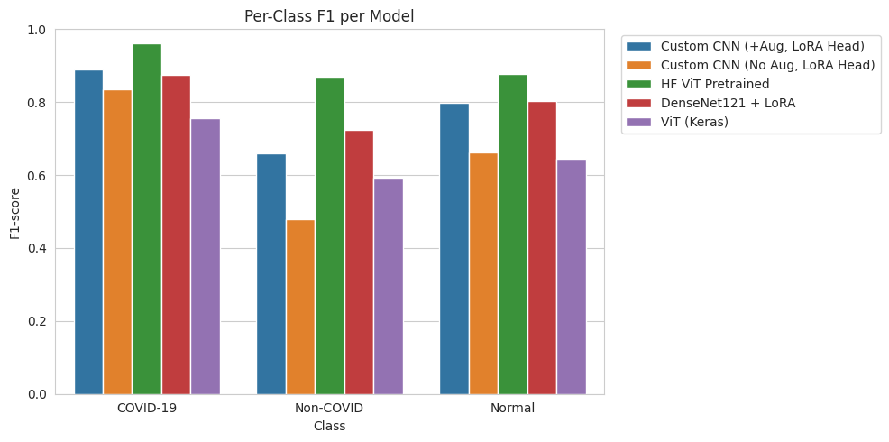

# Perbandingan Model

## 📊 Tabel Perbandingan Lengkap

### Semua Metrik

| Model | Akurasi | Macro F1 | Weighted F1 | Precision | Recall | F1 COVID-19 | F1 Non-COVID | F1 Normal |
|:------|:-------:|:--------:|:-----------:|:---------:|:------:|:-----------:|:------------:|:---------:|
| **HF ViT Pretrained** | **91.65%** | **0.9017** | **0.9163** | 0.916 | 0.917 | **0.9601** | **0.8677** | **0.8773** |
| **SVM (RBF)** | 86.27% | 0.843 | - | 0.862 | 0.863 | - | - | - |
| **DenseNet121 + LoRA** | 82.04% | 0.8003 | 0.8187 | 0.819 | 0.820 | 0.8743 | 0.7241 | 0.8025 |
| **Custom CNN (+Aug)** | 81.35% | 0.7825 | 0.8093 | 0.809 | 0.813 | 0.8901 | 0.6601 | 0.7972 |
| **kNN (k=5)** | 77.57% | 0.739 | - | 0.776 | 0.776 | - | - | - |
| **Random Forest** | 76.09% | 0.719 | - | 0.761 | 0.761 | - | - | - |
| **Custom CNN (No Aug)** | 71.74% | 0.6586 | 0.7024 | 0.702 | 0.717 | 0.8342 | 0.4788 | 0.6627 |
| **Pure Custom CNN (No LoRA, No Aug)** | 70.37% | 0.6347 | 0.6736 | 0.760 | 0.704 | 0.7907 | 0.4615 | 0.6517 |
| **ViT (Keras)** | 68.54% | 0.6645 | 0.6876 | 0.688 | 0.685 | 0.7569 | 0.5921 | 0.6446 |

## 🎯 Kategori Perbandingan

### 1. Akurasi

| Ranking | Model | Akurasi |
|:--------|:------|:-------:|
| 🥇 | **HF ViT Pretrained** | **91.65%** |
| 🥈 | **SVM (RBF)** | 86.27% |
| 🥉 | **DenseNet121 + LoRA** | 82.04% |
| 4 | Custom CNN (+Aug) | 81.35% |
| 5 | kNN (k=5) | 77.57% |
| 6 | Random Forest | 76.09% |
| 7 | Custom CNN (No Aug) | 71.74% |
| 8 | Pure Custom CNN (No LoRA, No Aug) | 70.37% |
| 9 | ViT (Keras) | 68.54% |

### 2. Macro F1-Score

| Ranking | Model | Macro F1 |
|:--------|:------|:--------:|
| 🥇 | **HF ViT Pretrained** | **0.9017** |
| 🥈 | **SVM (RBF)** | 0.843 |
| 🥉 | **DenseNet121 + LoRA** | 0.8003 |
| 4 | Custom CNN (+Aug) | 0.7825 |
| 5 | kNN (k=5) | 0.739 |
| 6 | Random Forest | 0.719 |
| 7 | ViT (Keras) | 0.6645 |
| 8 | Custom CNN (No Aug) | 0.6586 |
| 9 | Pure Custom CNN (No LoRA, No Aug) | 0.6347 |

### 3. F1 COVID-19

| Ranking | Model | F1 COVID-19 |
|:--------|:------|:-----------:|
| 🥇 | **HF ViT Pretrained** | **0.9601** |
| 🥈 | **Custom CNN (+Aug)** | 0.8901 |
| 🥉 | **DenseNet121 + LoRA** | 0.8743 |
| 4 | Custom CNN (No Aug) | 0.8342 |
| 5 | Pure Custom CNN (No LoRA, No Aug) | 0.7907 |
| 6 | ViT (Keras) | 0.7569 |

### 4. F1 Non-COVID

| Ranking | Model | F1 Non-COVID |
|:--------|:------|:------------:|
| 🥇 | **HF ViT Pretrained** | **0.8677** |
| 🥈 | **DenseNet121 + LoRA** | 0.7241 |
| 🥉 | **Custom CNN (+Aug)** | 0.6601 |
| 4 | ViT (Keras) | 0.5921 |
| 5 | Custom CNN (No Aug) | 0.4788 |
| 6 | Pure Custom CNN (No LoRA, No Aug) | 0.4615 |

### 5. F1 Normal

| Ranking | Model | F1 Normal |
|:--------|:------|:---------:|
| 🥇 | **HF ViT Pretrained** | **0.8773** |
| 🥈 | **DenseNet121 + LoRA** | 0.8025 |
| 🥉 | **Custom CNN (+Aug)** | 0.7972 |
| 4 | Custom CNN (No Aug) | 0.6627 |
| 5 | Pure Custom CNN (No LoRA, No Aug) | 0.6517 |
| 6 | ViT (Keras) | 0.6446 |

## 🔍 Analisis Per Kategori

### Classic ML vs Deep Learning

| Kategori | Best Model | Akurasi | Catatan |
|:---------|:-----------|:-------:|:--------|
| **Classic ML** | SVM (RBF) | 86.27% | Terbaik kedua overall |
| **Deep Learning** | HF ViT Pretrained | 91.65% | Terbaik overall |

**Kesimpulan:** Deep Learning dengan transfer learning mengungguli classic ML, namun SVM masih sangat kompetitif.

### From Scratch vs Transfer Learning

| Kategori | Best Model | Akurasi | Catatan |
|:---------|:-----------|:-------:|:--------|
| **From Scratch** | Custom CNN (+Aug) | 81.35% | Dengan augmentation |
| **Transfer Learning** | HF ViT Pretrained | 91.65% | +10.3% improvement |

**Kesimpulan:** Transfer learning memberikan keunggulan signifikan (+10.3%).

### Dengan vs Tanpa Augmentation & LoRA

**Efek LoRA (tanpa augmentation):**

| Model | Akurasi | Macro F1 | Improvement |
|:------|:-------:|:--------:|:-----------:|
| **Pure CNN (No LoRA)** | 70.37% | 0.6347 | Baseline |
| **Custom CNN + LoRA** | 71.74% | 0.6586 | **+1.37% / +0.0239** |

**Efek Data Augmentation (dengan LoRA):**

| Model | Tanpa Aug | Dengan Aug | Improvement |
|:------|:---------:|:----------:|:-----------:|
| **Custom CNN + LoRA** | 71.74% | 81.35% | **+9.61%** |

**Efek Gabungan (dari baseline pure):**

| Model | Akurasi | Macro F1 | Total Improvement |
|:------|:-------:|:--------:|:-----------------:|
| **Pure CNN (No LoRA, No Aug)** | 70.37% | 0.6347 | Baseline |
| **Custom CNN + LoRA + Aug** | 81.35% | 0.7825 | **+10.98% / +0.1478** |

**Kesimpulan:** Data augmentation memberikan dampak terbesar (+9.61%), LoRA menambah efisiensi parameter dan stabilitas (+1.37%).

## 📈 Trade-off Analysis

### Akurasi vs Model Size

| Model | Akurasi | Model Size | Trade-off |
|:------|:-------:|:----------:|:---------:|
| **HF ViT Pretrained** | 91.65% | ~350 MB | Akurasi maksimal |
| **DenseNet121 + LoRA** | 82.04% | ~30 MB | Keseimbangan baik |
| **Custom CNN (+Aug)** | 81.35% | ~1.8 MB | Sangat ringan |
| **SVM (RBF)** | 86.27% | ~95 MB | Baseline kuat |

### Akurasi vs Training Time

| Model | Akurasi | Training Time | Catatan |
|:------|:-------:|:-------------:|:--------|
| **HF ViT Pretrained** | 91.65% | ~2-3 jam | GPU required |
| **DenseNet121 + LoRA** | 82.04% | ~1-2 jam | GPU required |
| **Custom CNN (+Aug)** | 81.35% | ~30-45 min | GPU recommended |
| **SVM (RBF)** | 86.27% | ~10-15 min | CPU sufficient |

## 📊 Benchmark Lengkap - Deep Learning Models

### Tabel Perbandingan Enam Model Deep Learning

Selain analisis per-model, dilakukan juga **benchmark kuantitatif** yang secara khusus membandingkan enam model deep learning utama yang diuji pada Tahap 5-6:

1. **Pure Custom CNN (No LoRA, No Aug)** - Baseline murni tanpa optimasi
2. **Custom CNN (No Aug, LoRA Head)** - Baseline from scratch dengan LoRA
3. **Custom CNN (+Aug, LoRA Head)** - From scratch dengan augmentasi
4. **HF ViT Pretrained** - Transfer learning transformer (BEST)
5. **DenseNet121 + LoRA** - Transfer learning CNN
6. **ViT (Keras)** - Transformer from scratch

**Tabel Benchmark Lengkap:**

| Model | Akurasi | Macro F1 | Weighted F1 | F1 COVID-19 | F1 Non-COVID | F1 Normal |
|:------|:--------|:---------|:------------|:------------|:-------------|:----------|
| **HF ViT Pretrained** | **0.9165** | **0.9017** | **0.9163** | **0.9601** | **0.8677** | **0.8773** |
| **DenseNet121 + LoRA** | 0.8204 | 0.8003 | 0.8187 | 0.8743 | 0.7241 | 0.8025 |
| **Custom CNN (+Aug)** | 0.8135 | 0.7825 | 0.8093 | 0.8901 | 0.6601 | 0.7972 |
| **Custom CNN (No Aug)** | 0.7174 | 0.6586 | 0.7024 | 0.8342 | 0.4788 | 0.6627 |
| **Pure Custom CNN (No LoRA, No Aug)** | 0.7037 | 0.6347 | 0.6736 | 0.7907 | 0.4615 | 0.6517 |
| **ViT (Keras)** | 0.6854 | 0.6645 | 0.6876 | 0.7569 | 0.5921 | 0.6446 |

### Visualisasi Benchmark - Akurasi

**Gambar: Perbandingan Akurasi - Machine Learning Klasik vs Deep Learning (Bar Chart)**

**Gambar: Perbandingan Akurasi - All Models (Scatter Plot)**

### Visualisasi Benchmark - Macro F1

**Gambar: Perbandingan Macro F1 - Machine Learning Klasik vs Deep Learning (Bar Chart)**

**Gambar: Perbandingan Macro F1 - All Models (Scatter Plot)**

### Analisis Benchmark Kuantitatif

#### 1. Perbandingan Akurasi dan Macro-F1

Dari Tabel dan visualisasi terlihat beberapa poin penting:

**HF ViT Pretrained** muncul sebagai model deep learning dengan kinerja global terbaik:
- **Akurasi ≈ 91.65%** (tertinggi absolut)
- **Macro-F1 ≈ 0.90** (tertinggi absolut)
- Nilai ini menunjukkan bahwa setelah memanfaatkan pre-training skala besar dan fine-tuning yang hati-hati, ViT mampu melampaui seluruh konfigurasi CNN dan model klasik pada dataset ini

**DenseNet121 + LoRA** menempati posisi kedua:
- **Akurasi ≈ 82.04%**, **Macro-F1 ≈ 0.80**
- Hasil ini konsisten dengan analisis sebelumnya bahwa DenseNet + LoRA memberikan performa yang stabil dan seimbang di tiga kelas
- Masih unggul dari Custom CNN yang dilatih from scratch

**Custom CNN (+Aug, LoRA Head)** berada sedikit di bawah DenseNet121 + LoRA:
- **Akurasi ≈ 81.35%**, **Macro-F1 ≈ 0.78**
- Menariknya, pada benchmark ini, varian dengan augmentasi justru mengungguli varian tanpa augmentasi
- Ini mengindikasikan bahwa ketika skenario augmentasi disetel lebih moderat dan konsisten dengan pipeline model lain, Custom CNN dapat memanfaatkan augmentasi secara lebih efektif

**Pure Custom CNN (No LoRA, No Aug)**, **Custom CNN (No Aug, LoRA Head)**, dan **ViT (Keras)** berada di posisi terbawah:
- **Pure Custom CNN (No LoRA, No Aug):** akurasi ≈ 70.37%, Macro-F1 ≈ 0.63 (baseline murni)
- **Custom CNN No Aug (LoRA Head):** akurasi ≈ 71.74%, Macro-F1 ≈ 0.66 (peningkatan +1.37% dari LoRA)
- **ViT Keras:** akurasi ≈ 68.54%, Macro-F1 ≈ 0.66
- Ketiganya tetap memberi gambaran dasar yang penting: CNN kecil dari nol cenderung terbatas oleh kapasitas, LoRA memberikan sedikit peningkatan dengan efisiensi parameter, sedangkan ViT yang dilatih dari awal tanpa pre-training besar cenderung underfitting pada dataset berskala menengah

**Kesimpulan Umum:**
Benchmark ini menegaskan bahwa **pre-training skala besar** (HF ViT) dan **transfer learning CNN** (DenseNet + LoRA) memberikan lompatan performa yang signifikan dibanding model dari nol.

#### 2. Perbandingan Error Rate dan F1 per Kelas

Untuk memahami perilaku model di tiap kelas, digunakan visualisasi tambahan:

**Gambar: Error rate per kelas (1 − recall) untuk tiap model**

**Gambar: F1-score per kelas untuk tiap model**

Beberapa pola penting yang tampak:

**Kelas COVID-19:**
- **HF ViT Pretrained** mencapai F1 ≈ 0.96, menjadi yang tertinggi di antara semua model
- Error rate (1 − recall) untuk kelas ini paling kecil pada HF ViT, menandakan sensitivitas tinggi terhadap kasus positif
- **DenseNet121 + LoRA** dan **Custom CNN +Aug** juga menunjukkan performa baik (F1 di atas 0.87)
- Ketiga model ini layak dipertimbangkan untuk deteksi COVID-19 sebagai fokus utama

**Kelas Non-COVID:**
- Secara historis menjadi kelas tersulit; pola ini tetap terlihat
- **HF ViT Pretrained** kembali unggul dengan F1 ≈ 0.87
- **DenseNet121 + LoRA** menyusul (F1 ≈ 0.72)
- **Custom CNN +Aug** dan **ViT Keras** memiliki F1 lebih rendah (sekitar 0.66 dan 0.59)
- **Custom CNN No Aug** paling rendah (≈0.48)
- Ini memperkuat temuan bahwa kapasitas model dan informasi dari pre-training sangat membantu untuk membedakan pneumoni Non-COVID dari COVID-19 maupun Normal

**Kelas Normal:**
- **HF ViT Pretrained** dan **DenseNet121 + LoRA** kembali menjadi dua model teratas (F1 ≈ 0.88 dan ≈ 0.80)
- **Custom CNN +Aug** menunjukkan performa yang cukup kompetitif (F1 ≈ 0.80)
- Dua model lain sedikit tertinggal

**Kesimpulan Per Kelas:**
Secara keseluruhan, **HF ViT Pretrained** tidak hanya unggul dari sisi akurasi global, tetapi juga memberikan F1 yang tinggi dan relatif seimbang di ketiga kelas (COVID-19, Non-COVID, Normal). Sementara itu, **DenseNet121 + LoRA** menjadi kompromi yang baik antara kompleksitas arsitektur, kemudahan integrasi ke sistem CNN yang sudah umum, dan performa per kelas yang stabil.

#### 3. Posisi Akhir Model Deep Learning Berdasarkan Benchmark

Berdasarkan seluruh hasil benchmark ini, posisi lima model deep learning yang diuji dapat dirangkum sebagai berikut:

**🥇 HF ViT Pretrained**
- Menjadi **model deep learning terbaik** pada eksperimen ini jika dilihat dari akurasi, macro-F1, dan F1 per kelas
- Model ini sangat bergantung pada pre-training skala besar, tetapi setelah di-fine-tune menunjukkan kemampuan generalisasi yang sangat baik pada citra chest X-ray

**🥈 DenseNet121 + LoRA**
- Tetap menjadi **kandidat kuat**, sedikit di bawah HF ViT Pretrained
- Keunggulannya adalah:
  - Pipeline CNN yang sudah mapan di banyak sistem medis
  - Integrasi yang lebih mudah dengan teknik interpretabilitas berbasis feature map (misalnya Grad-CAM)
  - Kebutuhan komputasi yang relatif lebih "terukur" dibanding ViT besar

**🥉 Custom CNN (+Aug, LoRA Head)**
- Berfungsi sebagai **jembatan** antara model ringan dari nol dan arsitektur besar pre-trained
- Setelah augmentasi disetel dengan benar, model ini mampu mendekati performa DenseNet+LoRA dengan jumlah parameter yang jauh lebih kecil

**4️⃣ Custom CNN (No Aug, LoRA Head)**, **5️⃣ Pure Custom CNN (No LoRA, No Aug)**, dan **6️⃣ ViT (Keras)**
- Ketiganya lebih tepat diposisikan sebagai **baseline**:
  - **Custom CNN No Aug (LoRA)** menggambarkan batas kemampuan CNN kecil tanpa bantuan augmentasi yang memadai, dengan sedikit bantuan LoRA
  - **Pure Custom CNN (No LoRA, No Aug)** menggambarkan baseline murni CNN dari nol tanpa optimasi apapun
  - **ViT Keras** menggambarkan keterbatasan transformer yang dilatih dari nol pada dataset medis berskala menengah
  
**Insight dari Pure Custom CNN:**
- Memberikan baseline yang jelas untuk mengukur kontribusi LoRA (+1.37% akurasi) dan augmentasi (+9.61% dari LoRA baseline, +10.98% dari pure baseline)
- Menunjukkan bahwa kombinasi LoRA + Augmentasi memberikan peningkatan yang sangat signifikan dari baseline murni

#### 4. Integrasi dengan Model Klasik

Dalam konteks keseluruhan penelitian, benchmark ini juga memperjelas posisi relatif deep learning terhadap machine learning klasik:

**Ranking Keseluruhan:**

| Rank | Model | Kategori | Akurasi | Macro F1 |
|:----:|:------|:---------|:--------|:---------|
| **🥇** | HF ViT Pretrained | Deep Learning | **91.65%** | **0.9017** |
| **🥈** | SVM (RBF) | Classic ML | 86.27% | 0.843 |
| **🥉** | DenseNet121 + LoRA | Deep Learning | 82.04% | 0.8003 |
| 4 | Custom CNN (+Aug) | Deep Learning | 81.35% | 0.7825 |
| 5 | kNN (k=5) | Classic ML | 77.57% | 0.739 |
| 6 | Random Forest | Classic ML | 76.09% | 0.719 |
| 7 | Custom CNN (No Aug) | Deep Learning | 71.74% | 0.6586 |
| 8 | Pure Custom CNN (No LoRA, No Aug) | Deep Learning | 70.37% | 0.6347 |
| 9 | ViT (Keras) | Deep Learning | 68.54% | 0.6645 |

**Key Insights:**

1. **Pre-training berskala besar (HF ViT Pretrained)** dan **transfer learning CNN (DenseNet121 + LoRA)** memberikan peningkatan paling signifikan dibanding model dari nol
2. **SVM klasik tetap sangat kompetitif**, bahkan mengungguli banyak model deep learning (DenseNet, Custom CNN)
3. **LoRA memberikan efisiensi parameter signifikan**: Pure CNN (70.37%) vs CNN+LoRA (71.74%) - peningkatan +1.37% dengan parameter jauh lebih efisien
4. **Data Augmentation adalah faktor kunci**: peningkatan +9.61% dari LoRA baseline dan +10.98% dari pure baseline menunjukkan pentingnya augmentasi untuk model from scratch
5. **Custom CNN + LoRA** tetap relevan sebagai opsi model yang jauh lebih ringan, terutama bila resource komputasi terbatas atau deployment dilakukan pada perangkat dengan kemampuan hardware sederhana
6. **Untuk pengembangan ke depan**, kombinasi HF ViT Pretrained / DenseNet121 + LoRA dengan pendekatan klasik seperti HOG+SVM dalam sebuah **ensemble** berpotensi memberikan sistem pendukung keputusan yang:
   - Akurat secara global
   - Sensitif terhadap kasus COVID-19
   - Lebih robust terhadap variasi kualitas citra dan pola kelainan di kelas Non-COVID

## 💡 Rekomendasi Berdasarkan Use Case

### Untuk Akurasi Maksimal
- **Model:** HF ViT Pretrained
- **Akurasi:** 91.65%
- **Macro F1:** 0.9017
- **Trade-off:** Resource intensive (350 MB, ~2-3 jam training, GPU required)
- **Use Case:** Clinical decision support systems, research dengan prioritas akurasi

### Untuk Keseimbangan Performa-Efisiensi
- **Model:** DenseNet121 + LoRA
- **Akurasi:** 82.04%
- **Macro F1:** 0.8003
- **Trade-off:** Keseimbangan baik (~29 MB, ~1-2 jam training)
- **Use Case:** Hospital systems dengan resource sedang, integrasi dengan Grad-CAM

### Untuk Deployment Mobile/Edge
- **Model:** Custom CNN + LoRA dengan Augmentation
- **Akurasi:** 81.35%
- **Macro F1:** 0.7825
- **Trade-off:** Sangat ringan (~1.8 MB, ~30-45 min training)
- **Use Case:** Mobile apps, embedded systems, edge devices dengan storage/compute terbatas

### Untuk Baseline Tanpa GPU
- **Model:** SVM dengan HOG features
- **Akurasi:** 86.27%
- **Macro F1:** 0.843
- **Trade-off:** Ukuran model relatif besar (~95 MB), CPU sufficient
- **Use Case:** Systems tanpa GPU, rapid prototyping, feature engineering research

### Untuk Ensemble/Production System
- **Model:** Kombinasi HF ViT + SVM + DenseNet
- **Akurasi:** Potensial >92%
- **Trade-off:** Kompleksitas tinggi, resource intensive
- **Use Case:** Production systems dengan resource melimpah, prioritas akurasi maksimal

[📊 Lihat analisis detail →](analysis.md)

