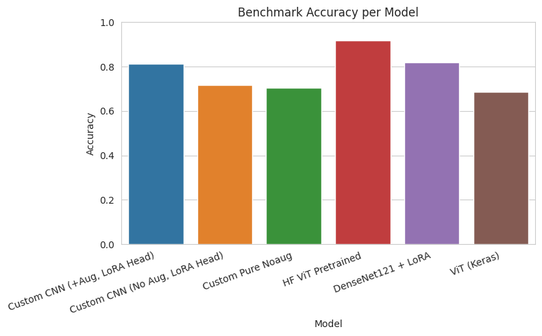

# Hasil Eksperimen - Overview

## 📊 Ringkasan Performa

### Perbandingan Semua Model

| Model | Akurasi | Macro F1 | Weighted F1 | F1 COVID-19 | F1 Non-COVID | F1 Normal |
|:------|:-------:|:--------:|:-----------:|:-----------:|:------------:|:---------:|
| **HF ViT Pretrained** | **91.65%** | **0.9017** | **0.9163** | **0.9601** | **0.8677** | **0.8773** |
| **SVM (RBF)** | 86.27% | 0.843 | - | - | - | - |
| **DenseNet121 + LoRA** | 82.04% | 0.8003 | 0.8187 | 0.8743 | 0.7241 | 0.8025 |
| **Custom CNN (+Aug)** | 81.35% | 0.7825 | 0.8093 | 0.8901 | 0.6601 | 0.7972 |
| **kNN (k=5)** | 77.57% | 0.739 | - | - | - | - |
| **Random Forest** | 76.09% | 0.719 | - | - | - | - |
| **Custom CNN (No Aug)** | 71.74% | 0.6586 | 0.7024 | 0.8342 | 0.4788 | 0.6627 |
| **Pure Custom CNN (No LoRA, No Aug)** | 70.37% | 0.6347 | 0.6736 | 0.7907 | 0.4615 | 0.6517 |
| **ViT (Keras)** | 68.54% | 0.6645 | 0.6876 | 0.7569 | 0.5921 | 0.6446 |

## 🏆 Model Terbaik

### HuggingFace ViT Pretrained

**Performa:**
- **Akurasi:** 91.65%
- **Macro F1:** 0.9017
- **F1 COVID-19:** 0.9601 (sangat tinggi)
- **F1 Non-COVID:** 0.8677
- **F1 Normal:** 0.8773

**Kelebihan:**
- ✅ Akurasi tertinggi di antara semua model
- ✅ Keseimbangan kelas sangat baik (semua F1 >0.87)
- ✅ F1 COVID-19 sangat tinggi (0.9601)
- ✅ Robust dan generalisasi baik

## 📈 Analisis Kategori

### Machine Learning Klasik

| Model | Akurasi | Macro F1 | Ranking |
|:------|:-------:|:--------:|:-------:|
| **SVM (RBF)** | **86.27%** | **0.843** | #2 Overall |
| **kNN (k=5)** | 77.57% | 0.739 | #6 Overall |
| **Random Forest** | 76.09% | 0.719 | #7 Overall |

**Kesimpulan:** SVM adalah pilihan terbaik untuk classic ML, bahkan mengungguli beberapa model deep learning.

### Deep Learning - From Scratch

| Model | Akurasi | Macro F1 | Catatan |
|:------|:-------:|:--------:|:--------|
| **Custom CNN (+Aug)** | 81.35% | 0.7825 | Dengan augmentation + LoRA |
| **Custom CNN (No Aug)** | 71.74% | 0.6586 | Tanpa augmentation + LoRA |
| **Pure Custom CNN (No LoRA, No Aug)** | 70.37% | 0.6347 | Baseline murni tanpa LoRA |
| **ViT (Keras)** | 68.54% | 0.6645 | From scratch |

**Kesimpulan:** Data augmentation sangat penting (+9.61% boost), LoRA memberikan efisiensi parameter dan stabilitas (+1.37% boost).

### Deep Learning - Transfer Learning

| Model | Akurasi | Macro F1 | Catatan |
|:------|:-------:|:--------:|:--------|
| **HF ViT Pretrained** | **91.65%** | **0.9017** | Best overall |
| **DenseNet121 + LoRA** | 82.04% | 0.8003 | Keseimbangan baik |

**Kesimpulan:** Transfer learning memberikan keunggulan signifikan.

## 🔍 Analisis Per Kelas

### F1-Score per Kelas

| Model | F1 COVID-19 | F1 Non-COVID | F1 Normal |
|:------|:-----------:|:------------:|:---------:|
| **HF ViT Pretrained** | **0.9601** | **0.8677** | **0.8773** |
| **Custom CNN (+Aug)** | 0.8901 | 0.6601 | 0.7972 |
| **DenseNet121 + LoRA** | 0.8743 | 0.7241 | 0.8025 |
| **Custom CNN (No Aug)** | 0.8342 | 0.4788 | 0.6627 |
| **Pure Custom CNN (No LoRA, No Aug)** | 0.7907 | 0.4615 | 0.6517 |
| **ViT (Keras)** | 0.7569 | 0.5921 | 0.6446 |

### Temuan

1. **F1 COVID-19:** Semua model deep learning mencapai >0.75, dengan HF ViT mencapai 0.9601
2. **F1 Non-COVID:** Kelas paling sulit, hanya HF ViT dan DenseNet121 yang mencapai >0.70
3. **F1 Normal:** Performa relatif baik untuk semua model (>0.64)

**Kesimpulan:** Non-COVID pneumonia adalah kelas paling challenging untuk dibedakan.

## 📊 Visualisasi Performa

### Accuracy vs Macro F1

### Benchmark Accuracy

### Benchmark Macro F1

### Per-Class F1

### Per-Class Error Rate (Recall)

## 💡 Key Insights

1. **Transfer Learning unggul:** HF ViT (91.65%) dan DenseNet121 (82.04%) mengungguli model from scratch
2. **Data Augmentation sangat penting:** Meningkatkan Custom CNN dari 70.37% (pure) / 71.74% (LoRA) menjadi 81.35%
3. **LoRA memberikan efisiensi:** Pure CNN (70.37%) vs CNN+LoRA (71.74%) - peningkatan +1.37% dengan parameter lebih efisien
4. **SVM masih relevan:** 86.27% akurasi sebagai baseline kuat tanpa GPU
5. **Non-COVID adalah kelas paling sulit:** F1 lebih rendah dibandingkan kelas lain (Pure CNN: 0.4615, CNN+LoRA: 0.4788)
6. **Trade-off Akurasi vs Efisiensi:** HF ViT akurasi tertinggi, Custom CNN paling ringan

[📊 Lihat analisis detail →](analysis.md)

[🖼️ Lihat visualisasi lengkap →](visualizations.md)

